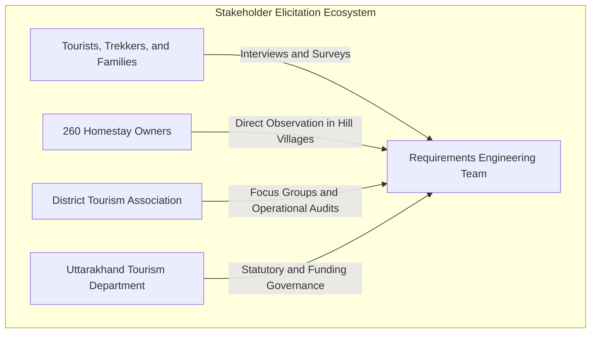

# Software Requirements Specification (SRS)
## Case Study 103: HomeStay  -  Booking Platform for Homestays in a Hill District (Uttarakhand)
**Document Standard:** IEEE Std 830-1998 Compliant  
**Project Sponsor:** Uttarakhand District Tourism Department & District Tourism Association  
**Target Release:** 16-Week Pre-Summer Season Window  

---

## 1. Introduction

### 1.1 Purpose
This Software Requirements Specification (SRS) establishes the complete functional, non-functional, and architectural requirements for the **HomeStay Booking Platform**. The system is engineered to digitize 260 homestays operating across a rugged hill district in Uttarakhand, transitioning existing informal manual bookings (phone calls, WhatsApp messaging) into a centralized, resilient, quality-assured, and low-bandwidth-tolerant digital ecosystem.

### 1.2 Document Conventions
* **FR-[XX]**: Functional Requirement identifier.
* **NFR-[XX]**: Non-Functional Requirement identifier with quantitative acceptance criteria.
* **MoSCoW**: Prioritization framework designating requirements as **Must Have (M)**, **Should Have (S)**, **Could Have (C)**, or **Won't Have this release (W)**.
* **Traceability Tagging**: Every functional requirement maps directly to verification test cases in `05_Test_Plan_and_Evidence.md`.

### 1.3 Intended Audience
* **Software Development Team**: For architecture, interface modeling, and sprint implementation.
* **Quality Assurance Engineers**: For verification, BVA, and automated test derivation.
* **Field Onboarding Team**: For listing coordination and rural homestay owner training.
* **District Tourism Association & Tourism Department Officials**: For contractual compliance, milestone sign-offs, and governance.

### 1.4 Project Scope
The platform provides a mobile-responsive Progressive Web Application (PWA) with offline-first synchronization capabilities for homestay owners and an intuitive booking portal for domestic and international tourists. The core platform encompasses:
1. Standardized homestay listings with verified photos and verified amenity badges.
2. Real-time dynamic availability calendar with double-booking prevention.
3. Secure digital payment processing with instant SMS/WhatsApp booking vouchers.
4. Post-stay verified guest review and rating engine.
5. Association and Tourism Department monitoring dashboard for regional tourism oversight, occupancy tracking, and revenue reporting.

---

## 2. Stakeholder Elicitation & User Personas

Requirements were elicited through semi-structured interviews, contextual inquiry, and direct on-site observation across rural hill clusters (e.g., Nainital, Almora, Pithoragarh, Chamoli sub-districts).

### 2.1 Elicitation Findings by Stakeholder Group
1. **Tourists (Inbound Domestic & International)**:
   * *Pain Point*: Inability to verify real room conditions; high risk of arrival-day rejection or bait-and-switch pricing during peak summer season.
   * *Demand*: Transparent pricing, instant date-locked confirmation, verified host photos, accurate road/trail access distance, and verified guest reviews.
2. **Homestay Owners (260 Local Families)**:
   * *Pain Point*: Low digital literacy, intermittent 2G/poor 4G coverage, constant fear of double-booking when phone and app bookings collide.
   * *Demand*: Zero-clutter visual calendar, offline viewing of upcoming arrivals, regional language support (Hindi / Garhwali / Kumaoni audio prompts), and guaranteed payouts.
3. **District Tourism Association**:
   * *Pain Point*: No aggregate data on seasonal footfalls, unchecked commission leakages, and reputational damage caused by overbooking disputes.
   * *Demand*: Centralized directory, grievance logging, standard pricing ceilings during festivals, and fair distribution of tourist traffic.
4. **Uttarakhand Tourism Department (Funding Authority)**:
   * *Pain Point*: Unregulated tourism growth and lack of safety compliance.
   * *Demand*: Strict 16-week delivery deadline before summer tourist influx; verified homestay registration licenses; traceable financial transactions; transparent analytics.

---

## 3. Functional Requirements (FRs)

The following 10 functional requirements form the core operational spine of the HomeStay platform:

| Req ID | Requirement Title | Requirement Description | Actor(s) | MoSCoW | Test Case Link |
| :--- | :--- | :--- | :--- | :--- | :--- |
| **FR-01** | **Multi-Attribute Listing Management** | The system shall allow field staff and owners to create and update homestay profiles, including geo-coordinates, room inventory, amenities, verified photos, owner contact, and verified tourism license number. | Field Staff, Homestay Owner | **Must Have** | `TC-FR01-01` |
| **FR-02** | **Dynamic Availability Calendar & Temporary Hold** | The system shall maintain real-time calendar availability per room. When a tourist initiates checkout, the selected dates shall be locked under a 15-minute temporary reservation lock to prevent concurrent double-booking. | Tourist, System Scheduler | **Must Have** | `TC-FR02-01`, `TC-FR02-02` |
| **FR-03** | **Integrated Secure Checkout & Escrow Payment** | The system shall process payments via UPI, debit/credit cards, and Net Banking through a secure payment gateway, supporting split payouts (association platform levy + owner escrow). | Tourist, Payment Gateway | **Must Have** | `TC-FR03-01` |
| **FR-04** | **Dual SMS & WhatsApp Fallback Voucher Generation** | Upon payment confirmation, the system shall generate an encrypted booking reference and dispatch booking confirmation vouchers via low-overhead SMS and WhatsApp to both the guest and the homestay owner. | System Notification Engine | **Must Have** | `TC-FR04-01` |
| **FR-05** | **Offline-First Owner Dashboard & Sync** | The owner interface shall operate locally as an offline-first PWA, caching the latest 30-day booking calendar, allowing offline check-in confirmations, and background-syncing state when internet is restored. | Homestay Owner | **Must Have** | `TC-FR05-01` |
| **FR-06** | **Manual Booking Entry (Direct/Walk-in Block)** | The system shall enable homestay owners to manually block dates for direct walk-in or telephone bookings with a single tap, updating the central inventory immediately upon network synchronization. | Homestay Owner | **Must Have** | `TC-FR06-01` |
| **FR-07** | **Verified Guest Review & Rating Engine** | The system shall issue a unique review submission token to tourists strictly post-checkout (within 48 hours). Only guests with verified completed stays shall be permitted to post ratings and written reviews. | Tourist, System | **Should Have** | `TC-FR07-01` |
| **FR-08** | **Tiered Cancellation & Automated Refund Engine** | The system shall evaluate cancellation requests against statutory hill-district cancellation rules (>7 days: 100% refund minus fee; 2 - 7 days: 50%; <48 hrs: 0% refund) and trigger automated gateway refunds. | Tourist, System Admin | **Must Have** | `TC-FR08-01` |
| **FR-09** | **District Association Governance Dashboard** | The system shall provide an administrative analytics dashboard for the association showing total registered homestays (out of 260), real-time occupancy rates, regional revenue, and unresolved disputes. | Association Officer | **Should Have** | `TC-FR09-01` |
| **FR-10** | **Tourism Department Compliance & Audit Export** | The system shall generate quarterly compliance reports, tax/levy summaries, safety certificate audit logs, and tourist footfall analytics, exportable in CSV and encrypted PDF formats. | Tourism Department Official | **Could Have** | `TC-FR10-01` |

---

## 4. Non-Functional Requirements (NFRs) with Measurable Targets

> **Strict Engineering Standard**: In accordance with project requirements, every NFR is defined with an unambiguous, quantitatively testable target. Subjective terms such as *"the system shall be fast"* or *"user friendly"* are prohibited.

| Req ID | NFR Category | Requirement Specification | Metric / Benchmark | Measurable Target / Acceptance Criteria |
| :--- | :--- | :--- | :--- | :--- |
| **NFR-01** | **Low-Bandwidth Usability** | The client PWA shall load and execute core booking and calendar interactions on high-latency 2G/EDGE networks (250 kbps, 600 ms RTT). | Initial bundle size & Time-to-Interactive (TTI) | **Initial asset bundle size $\le 450 \text{ KB}$ (gzipped); TTI $\le 3.5 \text{ seconds}$ on throttled 250 kbps network.** |
| **NFR-02** | **Image Optimization for Low Bandwidth** | Homestay listing photos must be compressed client-side before upload and served via WebP format with progressive JPEG fallbacks. | Image payload per homestay listing page | **Total image payload per listing $\le 350 \text{ KB}$; maximum single photo size $\le 120 \text{ KB}$ at $1080\times720\text{px}$.** |
| **NFR-03** | **System Availability & Uptime** | The central booking engine and API microservices shall maintain high availability throughout peak tourist season (May - July). | Monthly Uptime Percentage | **$\ge 99.5\%$ uptime** (unplanned downtime $\le 3.65 \text{ hours/month}$), monitored via external synthetic pingers at 60s intervals. |
| **NFR-04** | **Payment & Transaction Security** | Online payment transactions must strictly adhere to RBI payment aggregator guidelines and PCI-DSS Level 1 tokenization standards. | Encryption, Tokenization, and Leakage | **$100\%$ zero local storage of raw card/CVV/UPI PIN data; all transit encrypted with TLS 1.3; end-to-end webhook HMAC-SHA256 signature verification.** |
| **NFR-05** | **Concurrency & Overbooking Prevention** | The database must eliminate race conditions during simultaneous booking attempts for the same homestay room. | Booking collision rate under load | **0.00% double-booking error rate at 150 concurrent checkouts per second; optimistic lock collision resolved within $\le 200 \text{ ms}$.** |
| **NFR-06** | **Offline Data Resilience & Sync Latency** | The owner PWA must store calendar records locally using IndexedDB and reconcile changes with the server upon reconnection. | Sync time and data integrity | **Local IndexedDB capacity $\ge 30 \text{ days}$ offline data; automated reconciliation completed within $\le 4.0 \text{ seconds}$ of network re-acquisition with zero data loss.** |

---

## 5. Constraints and Assumptions

### 5.1 Technical Constraints
1. **Low-End Hardware**: Homestay owner mobile devices primarily consist of entry-level Android smartphones (Android 9.0+, 2GB RAM).
2. **Network Volatility**: Cellular connectivity in hill terrains fluctuates unpredictably between 4G, 2G, and total dropouts.
3. **Statutory Timeline**: The entire platform must be production-ready and fully onboarded across 260 homestays within **16 weeks** (prior to the pre-summer tourist rush).

### 5.2 Business & Field Assumptions
1. Field onboarding staff (3 personnel) have basic two-wheeler mobility to access remote hill hamlets.
2. Homestay owners or their designated family members possess at least basic vernacular reading literacy to operate icon-driven PWA screens.
3. The Tourism Department provides bulk authorization lists verifying legitimate homestay registration numbers.

---

## 6. Requirements Traceability Matrix (RTM)

The RTM ensures every elicited requirement is validated against formal verification mechanisms:

| FR ID | Requirement Description | MoSCoW | Architectural Component | Verification Method | Linked Test Case ID |
| :--- | :--- | :--- | :--- | :--- | :--- |
| **FR-01** | Homestay Listing Setup | Must | Listing Microservice | Functional / UI Test | `TC-FR01-01` |
| **FR-02** | Availability & 15-min Lock | Must | Calendar Engine (Redis Lock) | Concurrency / BVA Test | `TC-FR02-01`, `TC-FR02-02` |
| **FR-03** | Secure Gateway Checkout | Must | Payment Gateway Adapter | Security / Integration Test | `TC-FR03-01` |
| **FR-04** | SMS / WhatsApp Voucher | Must | Notification Microservice | Integration / Network Test | `TC-FR04-01` |
| **FR-05** | Offline Owner PWA Sync | Must | Service Worker / IndexedDB | Offline Network Simulation | `TC-FR05-01` |
| **FR-06** | Manual Walk-in Block | Must | Calendar Engine | Local State & Sync Test | `TC-FR06-01` |
| **FR-07** | Verified Post-Stay Review | Should | Feedback & Trust Service | Token Validation Test | `TC-FR07-01` |
| **FR-08** | Cancellation & Refund Tiers | Must | Settlement & Refund Rule Engine | Decision Table Test | `TC-FR08-01` |
| **FR-09** | Association Dashboard | Should | Analytics & Reporting Service | UI / Aggregation Test | `TC-FR09-01` |
| **FR-10** | Tourism Audit Report Export| Could | Compliance Export Engine | Export Format Test | `TC-FR10-01` |
