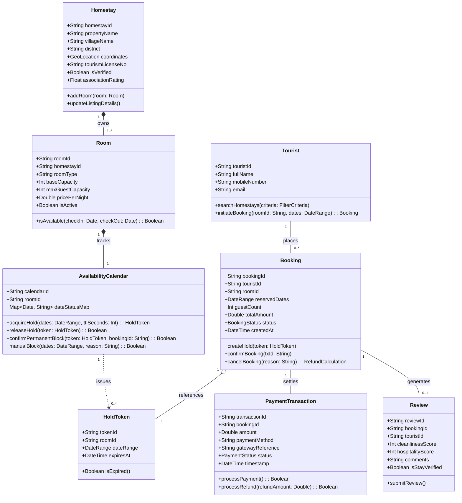
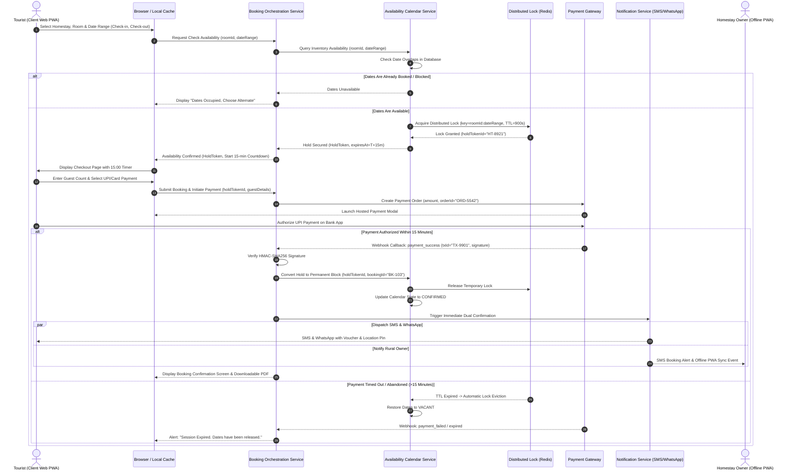
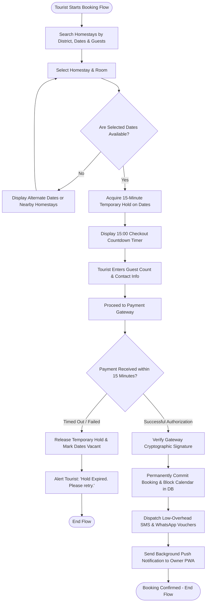
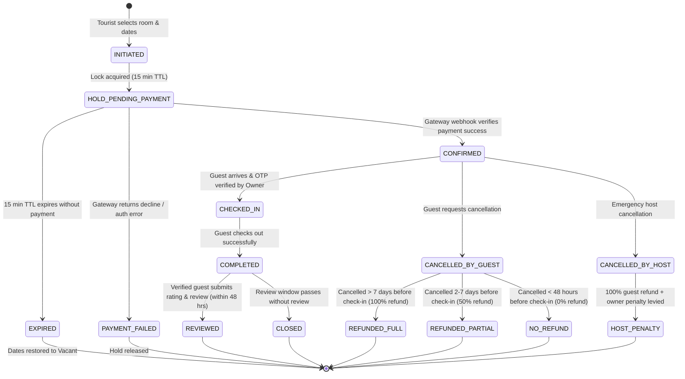

# Software Design & UML Architecture Package
## Case Study 103: HomeStay  -  Booking Platform for Homestays in a Hill District (Uttarakhand)
**Deliverable Type:** Object-Oriented Analysis & Design (OOAD) Specification  
**Architecture Paradigm:** Modular Service Architecture with Loose Coupling & Event-Driven Decoupling  

---

## 1. Architectural Blueprint & Design Principles

The HomeStay platform is designed with two fundamental architectural imperatives:
1. **High Cohesion**: Every subsystem encompasses a singular, narrowly defined business responsibility (e.g., the `AvailabilityCalendar` manages date interval occupancies and holds; the `PaymentGateway` manages financial authorization, tokenization, and webhooks).
2. **Loose Coupling**: The `AvailabilityCalendar` and `PaymentProcessing` modules possess zero direct knowledge of each other’s internal database schemas or APIs. Instead, they interact via an ephemeral mediator contract - the **Reservation Hold Token** - and asynchronous domain events (`HoldAcquired`, `PaymentSucceeded`, `HoldExpired`).

```mermaid
graph LR
    subgraph Client Layer
        T_UI[Tourist Web PWA]
        O_UI[Owner Offline-First PWA]
    end

    subgraph Core Domain Modules
        ListingMod[Listing & Profile Module]
        CalMod[Availability Calendar Module<br/><i>(Cohesive Temporal State)</i>]
        BookingMod[Booking & Reservation Saga<br/><i>(Mediator / Coordinator)</i>]
        PayMod[Payment Processing Module<br/><i>(Cohesive Financial Ledger)</i>]
        ReviewMod[Verified Review Module]
    end

    subgraph External Infrastructure
        PG[PCI-DSS Payment Gateway]
        SMS_GW[Dual SMS / WhatsApp Gateway]
        DB[(Distributed Database + Redis Lock)]
    end

    T_UI --> BookingMod
    O_UI --> CalMod
    BookingMod --> CalMod
    BookingMod --> PayMod
    PayMod --> PG
    BookingMod --> SMS_GW
    CalMod --> DB
```

---

## 2. Use Case Diagram

The use case model delineates the behavioral boundary between the system and its primary human/external actors:
* **Tourist**: Searches homestays, checks availability, pays, receives vouchers, and writes verified reviews.
* **Homestay Owner**: Manages room inventory, views offline bookings, and manually blocks direct walk-in dates.
* **Field Staff**: Conducts physical verification, captures geo-tagged photos, and configures baseline listings.
* **Association Admin**: Oversees district occupancy, monitors disputes, and tracks platform levies.
* **Payment Gateway**: Authorizes digital payments and dispatches signed webhooks.

```mermaid
usecaseDiagram
    actor Tourist as "Tourist / Guest"
    actor Owner as "Homestay Owner"
    actor Staff as "Field Onboarding Staff"
    actor Admin as "Tourism Association Admin"
    actor PG as "Payment Gateway"

    package "HomeStay Booking Platform" {
        usecase UC1 as "UC-01: Search & Filter Homestays"
        usecase UC2 as "UC-02: Check Availability & Hold Dates"
        usecase UC3 as "UC-03: Make Online Payment"
        usecase UC4 as "UC-04: Issue Dual Booking Voucher"
        usecase UC5 as "UC-05: Offline Calendar Sync & View"
        usecase UC6 as "UC-06: Block Dates for Direct Walk-ins"
        usecase UC7 as "UC-07: Submit Post-Stay Verified Review"
        usecase UC8 as "UC-08: Onboard Homestay & Verify Photos"
        usecase UC9 as "UC-09: Request Cancellation & Refund"
        usecase UC10 as "UC-10: View District Occupancy Dashboard"
    }

    Tourist --> UC1
    Tourist --> UC2
    Tourist --> UC3
    Tourist --> UC7
    Tourist --> UC9

    UC2 ..> UC3 : <<include>>
    UC3 ..> UC4 : <<include>>
    UC3 --> PG

    Owner --> UC5
    Owner --> UC6
    Staff --> UC8
    Admin --> UC10
```

---

## 3. Domain Class Diagram

The class diagram captures the structural domain model, entity attributes, operations, and multiplicity constraints.



---

## 4. Sequence Diagram: 'Check Availability and Book a Stay'

This diagram details the distributed flow between the client, calendar engine, distributed lock, booking orchestrator, and external payment gateway.



---

## 5. Activity Diagram: Booking Workflow

The activity diagram models the complete operational decision path from search initiation through calendar lock, payment verification, and voucher generation.



---

## 6. State Machine Diagram: Booking Lifecycle

This state machine models all valid operational states and transitions across the lifespan of a booking entity.



---

## 7. Architectural Justification: Coupling & Cohesion Analysis

### 7.1 Loose Coupling between Availability Calendar and Payments
In traditional, poorly architected booking platforms, the checkout module directly updates database tables for both financial transactions and room calendars inside one monolithic SQL transaction. This tight coupling creates catastrophic failures in hill districts:
* **The Failure Scenario**: If an owner’s phone loses connectivity during payment, or if the external payment gateway takes 8 seconds to return a webhook, a tightly coupled calendar remains frozen or enters inconsistent states.
* **Our Decoupled Solution**:
  1. **Mediator / Token Pattern**: The `AvailabilityCalendar` knows nothing about currency, UPI IDs, credit cards, or gateway API keys. It merely issues an opaque, time-bounded cryptographic token (`HoldToken`) valid for 15 minutes.
  2. **Event-Driven Communication**: When the payment gateway authorizes funds, it communicates strictly via an asynchronous event (`PaymentSuccessEvent`). The `BookingCoordinator` receives this event, validates the signature, and asks the `AvailabilityCalendar` to execute `confirmPermanentBlock(holdTokenId)`.
  3. **Fault Isolation**: If the payment gateway suffers third-party downtime, the calendar continues to operate seamlessly for walk-in blocks and offline queries.

### 7.2 High Cohesion Within Subsystems
Each module exhibits strict functional cohesion (elements inside the module work together to fulfill a single well-defined task):

| Module | Cohesion Focus | Internalized Responsibilities | Excluded Responsibilities |
| :--- | :--- | :--- | :--- |
| **Availability Calendar** | Temporal Inventory Integrity | Date intervals, overlapping holds, conflict detection, offline calendar cache. | Payment processing, pricing rules, guest contact info. |
| **Payment Gateway Adapter**| Financial Settlement | Gateway API handshake, webhook signature validation, refund calculation, escrow holds. | Room numbers, seasonal availability, homestay photos. |
| **Listing Service** | Content & Certification | Homestay descriptions, compressed WebP photos, GPS coordinates, tourism licenses. | Real-time booking states, payment histories. |
| **Notification Engine** | Dual-Channel Dispatch | SMS templates, WhatsApp fallback webhooks, offline push sync tokens. | Booking validation, refund calculation. |
