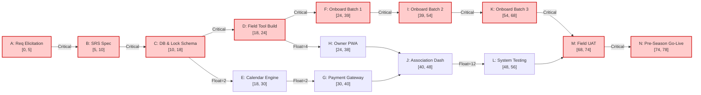

# Project Plan & Schedule Management
## Case Study 103: HomeStay  -  Booking Platform for Homestays in a Hill District (Uttarakhand)
**Planning Methodology:** Critical Path Method (CPM) & Agile-Iterative Hybrid Schedule  
**Target Window:** 16 Calendar Weeks (Strict Summer Season Deadline)  
**Assigned Resources:** 3 Full-Stack Developers (6 hrs/day), 3 Field Onboarding Staff (5 hrs/day)  

---

## 1. Executive Summary & Schedule Strategy

The project charter mandates the platform go live in **16 weeks** before the summer tourist influx across Uttarakhand.
* **Development Workload**: 1,150 person-hours $\div$ (3 developers $\times$ 6 hrs/day) = **63.89 working days** (~12.8 working weeks at 5 days/week).
* **Field Onboarding Workload**: 260 homestays $\times$ 2.5 hrs = 650 person-hours $\div$ (3 field staff $\times$ 5 hrs/day) = **43.33 working days** (~8.7 working weeks at 5 days/week).

**Critical Strategic Insight**:
Field onboarding cannot wait until the entire software platform is finished in Week 13; doing so would result in a serialized timeline of $13 + 8.7 = 21.7 \text{ weeks}$, severely breaching the 16-week deadline. Therefore, an **overlapping staged execution** is designed:
* The field onboarding tool (PWA mobile listing portal) is completed in **Sprint 2 (Week 4)**.
* Field onboarding commences immediately in **Week 5** and runs concurrently with backend/payment integration, concluding comfortably by **Week 14**.

---

## 2. Work Breakdown Structure (WBS)

```mermaid
graph TD
    WBS["1.0 HomeStay Booking Platform"]
    
    WBS --> P1["1.1 Requirements and Governance"]
    P1 --> W111["1.1.1 Stakeholder Elicitation in Hills"]
    P1 --> W112["1.1.2 IEEE 830 SRS and NFR Targets"]
    P1 --> W113["1.1.3 Association and Dept Sign-off"]

    WBS --> P2["1.2 Software Engineering and UML"]
    P2 --> W121["1.2.1 Architecture and Database Schema"]
    P2 --> W122["1.2.2 Core Calendar and Lock Engine"]
    P2 --> W123["1.2.3 Listing and Field Onboarding Tool"]
    P2 --> W124["1.2.4 Payment Gateway and Escrow Logic"]
    P2 --> W125["1.2.5 Low-Bandwidth Owner Offline PWA"]
    P2 --> W126["1.2.6 Association and Audit Dashboard"]

    WBS --> P3["1.3 Field Operations and Onboarding"]
    P3 --> W131["1.3.1 Cluster Route Planning and Gear Setup"]
    P3 --> W132["1.3.2 Batch 1 Onboarding: 90 Homestays"]
    P3 --> W133["1.3.3 Batch 2 Onboarding: 90 Homestays"]
    P3 --> W134["1.3.4 Batch 3 Onboarding: 80 Homestays"]

    WBS --> P4["1.4 Testing and Quality Assurance"]
    P4 --> W141["1.4.1 BVA and Concurrency Stress Testing"]
    P4 --> W142["1.4.2 2G Network Latency Simulation"]
    P4 --> W143["1.4.3 Field Pilot and Owner UAT"]

    WBS --> P5["1.5 Deployment and Pre-Season Launch"]
    P5 --> W151["1.5.1 Cloud Infrastructure Hardening"]
    P5 --> W152["1.5.2 Tourism Dept Formal Go-Live"]
```



---

## 3. Activity Dependency & CPM Attribute Table

*Note: Durations are expressed in working days (5 days per week).*

| Act ID | Activity Description | Predecessors | Duration ($D$) | Assigned Resources | ES | EF | LS | LF | Total Float | On Critical Path? |
| :---: | :--- | :---: | :---: | :--- | :---: | :---: | :---: | :---: | :---: | :---: |
| **A** | Requirements Elicitation & Hill Interviews | None | 5 days | Project Lead, 1 Dev | 0 | 5 | 0 | 5 | 0 | **YES** |
| **B** | SRS Formulation & Architecture Spec | A | 5 days | Lead Architect, 3 Devs | 5 | 10 | 5 | 10 | 0 | **YES** |
| **C** | DB Schema & Distributed Lock Setup | B | 8 days | Dev 1, Dev 2 | 10 | 18 | 10 | 18 | 0 | **YES** |
| **D** | Field Onboarding PWA Tool Build | C | 6 days | Dev 2, Dev 3 | 18 | 24 | 18 | 24 | 0 | **YES** |
| **E** | Calendar Engine & Double-Booking Lock | C | 12 days | Dev 1 | 18 | 30 | 20 | 32 | 2 | No |
| **F** | Field Onboarding Batch 1 (90 Homestays) | D | 15 days | 3 Field Staff | 24 | 39 | 24 | 39 | 0 | **YES** |
| **G** | Payment Gateway Integration & Webhooks | E | 10 days | Dev 2 | 30 | 40 | 32 | 42 | 2 | No |
| **H** | Owner Low-Bandwidth PWA & Offline Cache | D | 14 days | Dev 3 | 24 | 38 | 28 | 42 | 4 | No |
| **I** | Field Onboarding Batch 2 (90 Homestays) | F | 15 days | 3 Field Staff | 39 | 54 | 39 | 54 | 0 | **YES** |
| **J** | Association Dashboard & Compliance Export | G, H | 8 days | Dev 1, Dev 2 | 40 | 48 | 46 | 54 | 6 | No |
| **K** | Field Onboarding Batch 3 (80 Homestays) | I | 14 days | 3 Field Staff | 54 | 68 | 54 | 68 | 0 | **YES** |
| **L** | Integration & End-to-End System Testing | J | 8 days | 3 Devs | 48 | 56 | 60 | 68 | 12 | No |
| **M** | User Acceptance Testing (UAT) in Hills | K, L | 6 days | 3 Staff, 1 Dev | 68 | 74 | 68 | 74 | 0 | **YES** |
| **N** | Final Production Deployment & Go-Live | M | 4 days | All Resources | 74 | 78 | 74 | 78 | 0 | **YES** |

---

## 4. Critical Path Analysis (CPM)

### 4.1 Forward & Backward Pass Calculations
* **Total Project Duration**: **78 Working Days** (15.6 Weeks $\le$ 16.0 Week Deadline).
* **Critical Path**:
  $$\mathbf{A \to B \to C \to D \to F \to I \to K \to M \to N}$$
* **Mathematical Verification of the Critical Path**:
  $$\text{Path Duration} = 5 (\text{A}) + 5 (\text{B}) + 8 (\text{C}) + 6 (\text{D}) + 15 (\text{F}) + 15 (\text{I}) + 14 (\text{K}) + 6 (\text{M}) + 4 (\text{N}) = \mathbf{78 \text{ days}}$$



> **Key Managerial Finding**: The true Critical Path is governed by **Field Onboarding (Activities F, I, K)**, not pure software development! If field onboarding slips even by 2 days, the entire pre-summer launch slips.

---

## 5. 16-Week Master Gantt Chart

The Gantt chart illustrates the synchronization between software development sprints, field onboarding batches, testing phases, and pre-season go-live.

```mermaid
gantt
    dateFormat  YYYY-MM-DD
    title HomeStay 16-Week Master Project Schedule (Uttarakhand)
    excludes    weekends

    section Phase 1: Requirements & SRS
    Req Elicitation & Field Surveys (A)       :done,    actA, 2026-10-01, 5d
    IEEE 830 SRS & MoSCoW Baseline (B)         :done,    actB, after actA, 5d
    Milestone M1: SRS Approved                 :milestone, m1, after actB, 0d

    section Phase 2: Software Development
    DB Schema & Redis Lock Engine (C)          :active,  actC, after actB, 8d
    Field Onboarding Tool Build (D)            :active,  actD, after actC, 6d
    Milestone M2: Field Tool Ready             :milestone, m2, after actD, 0d
    Calendar Engine & Concurrency Lock (E)     :         actE, after actC, 12d
    Payment Gateway & Webhook Escrow (G)       :         actG, after actE, 10d
    Low-Bandwidth Owner Offline PWA (H)        :         actH, after actD, 14d
    Association Analytics Dashboard (J)        :         actJ, after actG, 8d
    Integration & End-to-End Testing (L)       :         actL, after actJ, 8d
    Milestone M3: Code Freeze                  :milestone, m3, after actL, 0d

    section Phase 3: Field Onboarding (260 Homestays)
    Onboarding Batch 1: 90 Homestays (F)       :         actF, after actD, 15d
    Onboarding Batch 2: 90 Homestays (I)       :         actI, after actF, 15d
    Onboarding Batch 3: 80 Homestays (K)       :         actK, after actI, 14d
    Milestone M4: 100% Homestays Onboarded     :milestone, m4, after actK, 0d

    section Phase 4: UAT & Go-Live
    On-Site Field UAT in Hill Villages (M)     :         actM, after actK, 6d
    Production Deployment & Public Launch (N)  :         actN, after actM, 4d
    Milestone M5: Pre-Summer Public Go-Live    :milestone, m5, after actN, 0d
```

---

## 6. Resource Allocation & Utilization Matrix

* 3 Software Developers: 6 working hours/day $\times$ 5 days/week = 30 hours/week per developer (**90 dev-hours/week total**).
* 3 Field Onboarding Staff: 5 working hours/day $\times$ 5 days/week = 25 hours/week per staff (**75 field-hours/week total**).

| Project Phase | Calendar Weeks | Dev 1 (Lead Backend) | Dev 2 (Full Stack) | Dev 3 (PWA / Mobile) | Field Staff (3 Personnel) |
| :--- | :---: | :--- | :--- | :--- | :--- |
| **Phase 1: Inception** | Weeks 1 - 2 | SRS & API Design | Architecture & Schemas | Wireframes & Benchmarks | Field Route Surveys |
| **Phase 2: Core Platform** | Weeks 3 - 5 | Lock Engine & Redis | Listing API & Onboard Tool | PWA Shell & IndexedDB | Training & Test Profiles |
| **Phase 3: Integration** | Weeks 6 - 8 | Calendar Logic | Payment Gateway & Escrow | Offline Sync & Cache | Onboard Batch 1 (90 Units) |
| **Phase 4: Scaling & Dash** | Weeks 9 - 11 | Association Dashboard | Audit & CSV Export | Notification & Fallback | Onboard Batch 2 (90 Units) |
| **Phase 5: Finalization** | Weeks 12 - 14 | Stress / Load Testing | Defect Remediation | Low-Bandwidth Optimizations | Onboard Batch 3 (80 Units) |
| **Phase 6: UAT & Go-Live** | Weeks 15 - 16 | Production Rollout | Ops Monitoring | Field Support | Village Owner Handholding |
