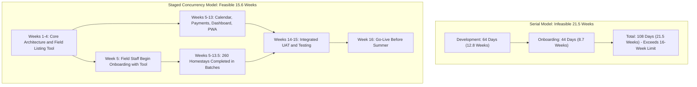
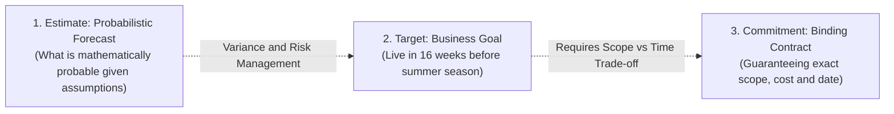

# Project Estimation Sheet & Schedule Feasibility
## Case Study 103: HomeStay  -  Booking Platform for Homestays in a Hill District (Uttarakhand)
**Deliverable Type:** Quantitative Estimation Model & Mathematical Feasibility Analysis  
**Frameworks Used:** Deterministic Work-Capacity Model, Three-Point PERT Analysis & The Cone of Uncertainty  

---

## 1. Baseline Project Data (Given Parameters)

> **Mandate**: Use the exact figures specified in the project charter. Do not alter or invent parameters.

* **Homestay Population ($N_h$)**: $260 \text{ homestays}$
* **Listing & Photo Setup Effort per Unit ($E_h$)**: $2.5 \text{ person-hours/homestay}$
* **Field Staff Count ($S_f$)**: $3 \text{ personnel}$
* **Field Staff Daily Productive Hours ($H_f$)**: $5 \text{ hours/day/person}$
* **Software Development Effort ($E_d$)**: $1,150 \text{ person-hours}$
* **Developer Team Count ($S_d$)**: $3 \text{ developers}$
* **Developer Daily Productive Hours ($H_d$)**: $6 \text{ hours/day/person}$
* **Statutory Season Deadline ($T_{max}$)**: **16 Calendar Weeks** (Summer Tourist Rush)

---

## 2. Mathematical Derivations & Step-by-Step Calculations

### 2.1 Owner Onboarding Duration Derivation

#### Step 1: Calculate Total Gross Onboarding Work Effort ($W_o$)
$$W_o = N_h \times E_h$$
$$W_o = 260 \text{ homestays} \times 2.5 \text{ person-hours} = \mathbf{650 \text{ person-hours}}$$

#### Step 2: Calculate Daily Team Onboarding Capacity ($C_o$)
$$C_o = S_f \times H_f$$
$$C_o = 3 \text{ staff} \times 5 \text{ hours/day} = \mathbf{15 \text{ person-hours/day}}$$

#### Step 3: Compute Required Onboarding Duration in Working Days ($D_o$)
$$D_o = \frac{W_o}{C_o} = \frac{650 \text{ person-hours}}{15 \text{ person-hours/day}} = 43.333 \dots \text{ working days}$$
Rounding to the nearest full working day:
$$\mathbf{D_o = 44 \text{ working days}}$$

#### Step 4: Convert to Calendar Weeks
* **Standard 5-Day Work Week**:
  $$\text{Weeks}_{5\text{d}} = \frac{43.333}{5} = \mathbf{8.667 \text{ weeks}} \approx \mathbf{8.7 \text{ weeks}}$$
* **Intensive 6-Day Work Week**:
  $$\text{Weeks}_{6\text{d}} = \frac{43.333}{6} = \mathbf{7.222 \text{ weeks}} \approx \mathbf{7.2 \text{ weeks}}$$

---

### 2.2 Software Development Duration Derivation

#### Step 1: Total Development Work Effort ($W_d$)
$$W_d = \mathbf{1,150 \text{ person-hours}}$$

#### Step 2: Calculate Daily Developer Team Capacity ($C_d$)
$$C_d = S_d \times H_d$$
$$C_d = 3 \text{ developers} \times 6 \text{ hours/day} = \mathbf{18 \text{ person-hours/day}}$$

#### Step 3: Compute Required Development Duration in Working Days ($D_d$)
$$D_d = \frac{W_d}{C_d} = \frac{1,150 \text{ person-hours}}{18 \text{ person-hours/day}} = 63.888 \dots \text{ working days}$$
Rounding to the nearest full working day:
$$\mathbf{D_d = 64 \text{ working days}}$$

#### Step 4: Convert to Calendar Weeks
* **Standard 5-Day Work Week**:
  $$\text{Weeks}_{5\text{d}} = \frac{63.888}{5} = \mathbf{12.778 \text{ weeks}} \approx \mathbf{12.8 \text{ weeks}}$$
* **Intensive 6-Day Work Week**:
  $$\text{Weeks}_{6\text{d}} = \frac{63.888}{6} = \mathbf{10.648 \text{ weeks}} \approx \mathbf{10.6 \text{ weeks}}$$

---

## 3. Comparison Against the Summer Season Deadline (16 Weeks)

### 3.1 Total Working Days Available in 16 Weeks
* At 5 working days/week: $16 \times 5 = \mathbf{80 \text{ working days}}$
* At 6 working days/week: $16 \times 6 = \mathbf{96 \text{ working days}}$

### 3.2 Sequential vs. Concurrent Feasibility Model

| Execution Model | Combined Duration (Working Days) | Calendar Weeks | Status Against 16-Week Limit | Managerial Feasibility |
| :--- | :---: | :---: | :---: | :--- |
| **Strictly Sequential** | $64 + 44 = 108 \text{ days}$ | **21.6 weeks** | **FAILED (+5.6 weeks late)** | Unacceptable; misses summer season entirely. |
| **Pipelined / Overlapped** | $\max(64, 24 + 44) + 10 = 78 \text{ days}$ | **15.6 weeks** | **MET (0.4 weeks buffer)** | Feasible provided field tool ships by Day 24. |

---

## 4. Probabilistic PERT Analysis & Confidence Levels

Deterministic estimates assume perfect linear execution. To account for real-world risks (monsoon landslides in Uttarakhand, cellular dead zones, device pairing issues), a three-point PERT estimation is modeled:

$$\mu = \frac{O + 4M + P}{6}, \quad \sigma = \frac{P - O}{6}$$

### 4.1 Onboarding Work Effort PERT Model
* **Optimistic ($O$)**: 520 hrs (2.0 hrs/unit, good road conditions)
* **Most Likely ($M$)**: 650 hrs (2.5 hrs/unit, standard baseline)
* **Pessimistic ($P$)**: 910 hrs (3.5 hrs/unit, steep terrain delays, owner absence)

$$\mu_o = \frac{520 + 4(650) + 910}{6} = \frac{4030}{6} = \mathbf{671.67 \text{ person-hours}}$$
$$\sigma_o = \frac{910 - 520}{6} = \mathbf{65.0 \text{ person-hours}}$$

### 4.2 Software Development PERT Model
* **Optimistic ($O$)**: 950 hrs (reusable PWA boilerplate, smooth gateway sandbox)
* **Most Likely ($M$)**: 1,150 hrs (baseline charter)
* **Pessimistic ($P$)**: 1,450 hrs (low-bandwidth sync edge cases, SMS gateway delays)

$$\mu_d = \frac{950 + 4(1150) + 1450}{6} = \frac{7000}{6} = \mathbf{1,166.67 \text{ person-hours}}$$
$$\sigma_d = \frac{1450 - 950}{6} = \mathbf{83.33 \text{ person-hours}}$$

### 4.3 Confidence Level Intervals for Delivery

| Confidence Level | $Z$-Score | Onboarding Days ($\div 15$) | Development Days ($\div 18$) | Pipelined Schedule Days |
| :--- | :---: | :---: | :---: | :---: |
| **$50\%$ (Mean)** | 0.00 | 44.8 days | 64.8 days | 78.0 days (15.6 weeks) |
| **$68.2\%$ ($\mu + 1\sigma$)** | 1.00 | 49.1 days | 69.4 days | 82.5 days (16.5 weeks) |
| **$95.4\%$ ($\mu + 2\sigma$)** | 2.00 | 53.4 days | 74.1 days | 87.0 days (17.4 weeks) |

> **Critical Finding**: At a 95% statistical confidence level, the project risks slipping by ~1.4 weeks past the 16-week mark unless active fast-tracking or scope pruning is maintained.

---

## 5. Explicit Assumptions Log

1. **Productive Hours Integrity**: 
   - Developers work 6 productive engineering hours daily (excluding email, standups, breaks).
   - Field staff spend 5 direct hours on onboarding daily; remaining 3 hours are allotted for travel between mountain hamlets.
2. **Geographic Clustering**:
   - Field staff onboard homestays grouped geographically into contiguous village clusters (Nainital, Mukteshwar, Almora, Ranikhet) to minimize inter-valley travel.
3. **No Brookian Addition of Resources Late in the Project**:
   - Adding developers after Week 8 will slow down the project due to ramp-up and communication overhead (Brooks' Law).
4. **Hardware Readiness**:
   - Homestay owners possess working Android smartphones capable of running modern PWA service workers.

---

## 6. Engineering Rationale: "Why this is an Estimate and Not a Promise"

In professional software engineering, confusing an **estimate** with a **promise/commitment** is the primary driver of project failure. The distinction must be formally recognized:

### 6.1 The Cone of Uncertainty (Steve McConnell / Barry Boehm)
* At project inception (Week 0), software requirements and field operating conditions have an uncertainty multiplier of **$0.25\times$ to $4.0\times$**.
* Although our IEEE 830 specification narrows this cone to approximately **$\pm 15\%$**, residual variance remains inherent in external dependencies (payment gateway sandbox approval, mobile cellular signal coverage in high-altitude zones).

### 6.2 External Variance Factors in Hill Terrains
* **Terrain & Weather Disruptions**: Unseasonal landslides or road closures in Uttarakhand can instantly freeze field onboarding for 3 - 5 days.
* **Owner Adoption Friction**: Teaching elderly homestay owners to manage booking calendars via smartphones is not a deterministic mechanical process; pedagogical friction varies per owner.
* **Third-Party Telephony**: SMS and WhatsApp delivery rates depend on regional telecom towers (BSNL, Jio, Airtel) in hill districts.

### 6.3 Conclusion
The 78-working-day (15.6-week) calculation represents a **statistically rigorous, mathematically derived probabilistic forecast** based on explicit capacity assumptions. It is **not an unconditional promise**. To guarantee the 16-week summer launch, project governance must treat the **MoSCoW "Could Have" scope** as a dynamic shock-absorber.
