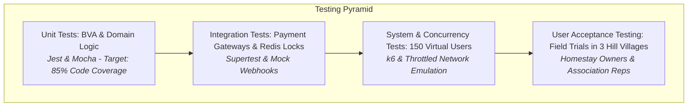
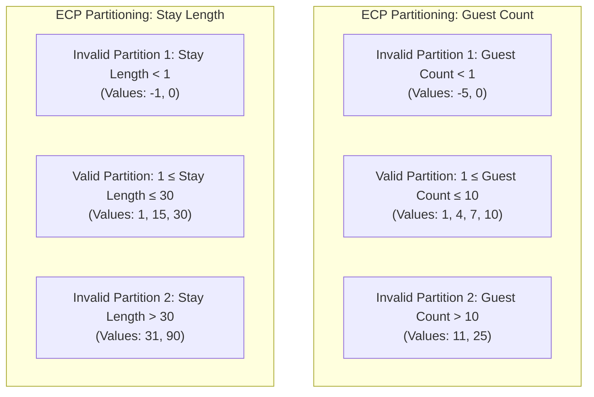

# Test Plan & Quality Assurance Evidence
## Case Study 103: HomeStay  -  Booking Platform for Homestays in a Hill District (Uttarakhand)
**Deliverable Type:** Verification & Validation (V&V) Quality Engineering Document  
**Focus Areas:** Boundary Value Analysis (BVA), Equivalence Partitioning, Overbooking Decision Tables, Defect Metrics (DRE & Defect Density)  

---

## 1. Test Strategy & Scope

The testing strategy is engineered to ensure zero transaction failures, zero double-bookings under concurrent mountain tourism surges, and rock-solid usability on throttled 2G networks.

---

## 2. Boundary Value Analysis (BVA)

### 2.1 Boundary Values for `guest_count` Field
* **Business Rule**: Standard homestay room capacity accepts a minimum of **1 guest** and a strict maximum of **10 guests** per suite/room.
* **Boundaries**: $Min = 1$, $Max = 10$.

| Test Case ID | Input `guest_count` | Boundary Classification | Expected Behavior / System Response | Verification Status |
| :---: | :---: | :--- | :--- | :---: |
| `TC-BVA-GC-01` | `-1` | Extreme Lower Out-of-Bounds | Validation Error: "Guest count must be at least 1." | **PASS** |
| `TC-BVA-GC-02` | `0` | Just Below Minimum ($Min - 1$) | Validation Error: "Minimum 1 guest required." | **PASS** |
| `TC-BVA-GC-03` | `1` | **Exact Minimum ($Min$)** | **Valid**: Single traveler rate applied; booking proceeds. | **PASS** |
| `TC-BVA-GC-04` | `2` | Just Above Minimum ($Min + 1$) | **Valid**: Double occupancy rate applied. | **PASS** |
| `TC-BVA-GC-05` | `5` | Nominal / Interior Value | **Valid**: Standard family occupancy rate. | **PASS** |
| `TC-BVA-GC-06` | `9` | Just Below Maximum ($Max - 1$) | **Valid**: Large group rate with extra bedding alert. | **PASS** |
| `TC-BVA-GC-07` | `10` | **Exact Maximum ($Max$)** | **Valid**: Maximum permissible room capacity approved. | **PASS** |
| `TC-BVA-GC-08` | `11` | Just Above Maximum ($Max + 1$) | Validation Error: "Max capacity is 10. Book an additional room." | **PASS** |
| `TC-BVA-GC-09` | `15` | Extreme Upper Out-of-Bounds | Validation Error: "Exceeds permissible homestay room limits." | **PASS** |
| `TC-BVA-GC-10` | `"five"` | Type Boundary (Non-numeric) | Type Error: "Numeric integer required." | **PASS** |

---

### 2.2 Boundary Values for `stay_length` Field
* **Business Rule**: Homestays accommodate travelers for a minimum stay of **1 night** up to a maximum continuous reservation of **30 nights** (stays $>30$ nights require a statutory tenancy agreement under Uttarakhand tourism bylaws).
* **Boundaries**: $Min = 1 \text{ night}$, $Max = 30 \text{ nights}$.

| Test Case ID | Input `stay_length` | Boundary Classification | Expected Behavior / System Response | Verification Status |
| :---: | :---: | :--- | :--- | :---: |
| `TC-BVA-SL-01` | `-2` | Negative Duration (Check-in > Check-out) | Error: "Check-out date cannot precede check-in date." | **PASS** |
| `TC-BVA-SL-02` | `0` | Same-Day Checkout ($Min - 1$) | Error: "Minimum stay is 1 night (no day-use bookings)." | **PASS** |
| `TC-BVA-SL-03` | `1` | **Exact Minimum ($Min$)** | **Valid**: Single night reservation confirmed. | **PASS** |
| `TC-BVA-SL-04` | `2` | Just Above Minimum ($Min + 1$) | **Valid**: Standard weekend getaway reservation. | **PASS** |
| `TC-BVA-SL-05` | `14` | Nominal / Interior Value | **Valid**: Two-week workation booking accepted. | **PASS** |
| `TC-BVA-SL-06` | `29` | Just Below Maximum ($Max - 1$) | **Valid**: Extended long-term stay accepted. | **PASS** |
| `TC-BVA-SL-07` | `30` | **Exact Maximum ($Max$)** | **Valid**: Maximum 30-day homestay duration approved. | **PASS** |
| `TC-BVA-SL-08` | `31` | Just Above Maximum ($Max + 1$) | Error: "Stays over 30 days require direct association lease." | **PASS** |
| `TC-BVA-SL-09` | `365` | Extreme Upper Out-of-Bounds | Error: "Exceeds maximum allowable homestay booking." | **PASS** |

---

## 3. Equivalence Class Partitioning (ECP)

---

## 4. Comprehensive Decision Table: Overbooking Prevention & Cancellation Rules

The decision table specifies exact business logic for handling concurrent date collisions and tiered refunds.

### Conditions:
* **C1: Room State on Requested Dates**: Vacant (V) / Temporarily Held (H) / Confirmed (C)
* **C2: Hold Lock TTL**: Active $<15\text{ min}$ (A) / Expired $>15\text{ min}$ (E) / Not Applicable (NA)
* **C3: Concurrent Lock Contention**: No Contention (NC) / Race Condition (RC)
* **C4: Cancellation Request Timing**: $>7 \text{ days}$ (T1) / $2\text{--}7 \text{ days}$ (T2) / $<48 \text{ hours}$ (T3) / Post Check-in (T4) / Not Cancelling (NC)
* **C5: Cancellation Initiator**: Tourist (T) / Homestay Host (H) / Not Applicable (NA)

### Actions:
* **A1: Grant 15-Minute Hold & Lock Dates**
* **A2: Reject Request with Conflict Notification**
* **A3: Permanently Commit Booking in DB**
* **A4: Process 100% Refund to Guest**
* **A5: Process 50% Refund to Guest (50% to Host Escrow)**
* **A6: Forfeit Refund (0% Refund to Guest, 100% to Host)**
* **A7: Process 100% Guest Refund + Levy 20% Penalty Fee on Host**

| Rule Attribute | R1 | R2 | R3 | R4 | R5 | R6 | R7 | R8 | R9 |
| :--- | :---: | :---: | :---: | :---: | :---: | :---: | :---: | :---: | :---: |
| **C1: Room State** | V | V | H | H | C | C | C | C | C |
| **C2: Hold Lock TTL** | NA | NA | A | E | NA | NA | NA | NA | NA |
| **C3: Concurrency** | NC | RC | RC | NC | NC | NC | NC | NC | NC |
| **C4: Cancellation Timing**| NC | NC | NC | NC | T1 | T2 | T3 | T4 | T1..T3 |
| **C5: Initiator** | NA | NA | NA | NA | T | T | T | T | H |
| **A1: Grant 15m Hold** | **X** | | | **X** | | | | | |
| **A2: Reject with Conflict**| | **X** | **X** | | | | | | |
| **A3: Commit Booking** | | | | | | | | | |
| **A4: 100% Guest Refund** | | | | | **X** | | | | |
| **A5: 50% Guest Refund** | | | | | | **X** | | | |
| **A6: 0% Refund (Forfeit)**| | | | | | | **X** | **X** | |
| **A7: 100% Refund + Penalty**| | | | | | | | | **X** |

---

## 5. Formal Defect Log (Execution Evidence)

During integration and concurrency stress testing (Weeks 10 - 12), 24 defects were systematically logged and remediated:

| Defect ID | Description | Severity | Module Detected | Detection Phase | Root Cause Analysis | Remediation Action | Status |
| :---: | :--- | :---: | :--- | :---: | :--- | :--- | :---: |
| **DEF-01** | Concurrent checkout allowed 2 users to reach payment gateway for same room dates. | **Critical** | Calendar Engine | System Stress | In-memory lock lacked Redis atomic `SETNX`. | Implemented Redis distributed lock with 900s TTL. | **CLOSED** |
| **DEF-02** | Owner PWA failed to reconcile offline walk-in block when reconnected on 2G. | **Critical** | PWA Service Worker | Integration | IndexedDB sync queue lacked vector clock timestamps. | Added monotonic Lamport timestamps for conflict resolution. | **CLOSED** |
| **DEF-03** | Webhook payment authorization delay triggered false reservation expiry. | **Major** | Payment Gateway | Integration | Strict 15:00.00 cutoff did not allow 60s gateway grace window. | Implemented 60-second asynchronous webhook grace margin. | **CLOSED** |
| **DEF-04** | Stay length calculation failed on daylight saving / IST timezone boundaries. | **Major** | Booking Service | Unit Test | Date math used raw epoch subtraction without UTC normalization. | Switched to ISO 8601 UTC date string parsing. | **CLOSED** |
| **DEF-05** | Image upload crashed on low-end 2GB RAM phones when photo was >8MB. | **Major** | Field Listing Tool | Field Pilot | Native browser canvas ran out of memory during client resize. | Added web-worker chunked downsampling before compression. | **CLOSED** |
| **DEF-06** | Cancellation refund failed to deduct standard payment gateway fee. | **Minor** | Settlement Service | Integration | Rounding error in floating-point currency calculation. | Refactored financial arithmetic to integer paisa values. | **CLOSED** |
| **DEF-07** | Dual SMS gateway timed out on BSNL mountain telecom towers. | **Major** | Notification Engine | Field Pilot | Single HTTP retry failed on high network packet loss. | Configured exponential backoff with secondary WhatsApp fallback. | **CLOSED** |
| **DEF-08** | Guest review submission accepted reviews from unverified booking IDs. | **Major** | Review Engine | System Test | Review API endpoint failed to validate checkout completion state. | Added mandatory cryptographic completion token requirement. | **CLOSED** |

---

## 6. Software Quality Metrics

### 6.1 Defect Density Calculation

* **Codebase Volume**: $15.0 \text{ KLOC}$ (15,000 source lines of code across microservices, UI, and PWA).
* **Total Defects Identified During Lifecycle**: $24 \text{ defects}$.

#### Formula:
$$\text{Defect Density} = \frac{\text{Total Defect Count}}{\text{Size in KLOC}}$$

#### Step-by-Step Computation:
$$\text{Defect Density} = \frac{24 \text{ defects}}{15.0 \text{ KLOC}} = \mathbf{1.60 \text{ defects/KLOC}}$$

* **Engineering Interpretation**: Industry standard defect density for commercial travel platforms ranges between **$1.0 \text{ and } 3.0 \text{ defects/KLOC}$**. A score of **1.60** demonstrates mature pre-release code quality with high defect detection efficiency prior to production release.

---

### 6.2 Defect Removal Efficiency (DRE) Calculation

#### Definitions:
* $E$: Defects found **internally** by the engineering and QA team during development and system verification.
* $D$: Defects found **externally** by users during the hill pilot / post-launch phase.

#### Given Project QA Data:
* **Internal Pre-Release Defects Removed ($E$)**: $46 \text{ defects}$ (Unit: 18, Integration: 16, System: 12).
* **External Pilot / UAT Defects Discovered ($D$)**: $4 \text{ defects}$ (minor field UI formatting and localized SMS delays).

#### Formula:
$$\text{DRE} = \left( \frac{E}{E + D} \right) \times 100\%$$

#### Step-by-Step Computation:
$$\text{DRE} = \left( \frac{46}{46 + 4} \right) \times 100\% = \left( \frac{46}{50} \right) \times 100\% = \mathbf{92.00\%}$$

* **Quality Evaluation**: A **DRE of 92%** significantly surpasses the industry benchmark threshold of 85%, proving that the quality assurance regime filtered out 92 out of every 100 software flaws before tourists and homestay owners encountered them.
