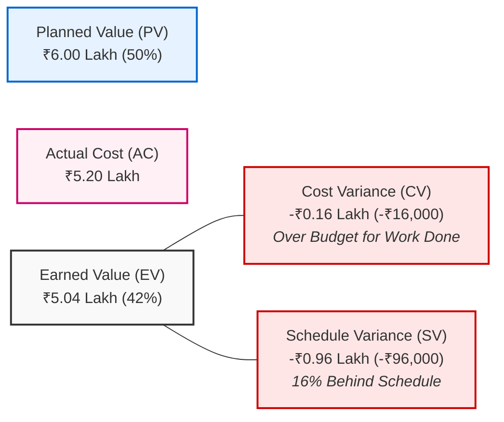

# Risk Management, Monitoring & Week-8 Status Report
## Case Study 103: HomeStay  -  Booking Platform for Homestays in a Hill District (Uttarakhand)
**Deliverable Type:** Earned Value Project Control & Comprehensive Risk Governance  
**Governance Authority:** District Tourism Department (Project Sponsor) & Tourism Association  

---

## 1. Week-8 Executive Status Report for the Tourism Department

### 1.1 Project Status At-A-Glance
* **Reporting Period**: Week 8 of 16 (Mid-Point Milestone)
* **Project Planned Budget ($BAC$)**: ₹12.00 Lakh
* **Overall Health**: **AMBER (Requires Corrective Action Approval)**



---

### 1.2 Earned Value Management (EVM) Mathematical Derivations

#### A. Given Charter Parameters (Week 8)
* **Planned Spend to Date ($PV$)**: $\mathbf{₹6.00 \text{ Lakh}}$ (₹600,000)
* **Planned Work Complete**: $\mathbf{50.0\%}$
  $$\implies \text{Budget at Completion } (BAC) = \frac{₹6.00 \text{ Lakh}}{0.50} = \mathbf{₹12.00 \text{ Lakh}}$$
* **Actual Spend to Date ($AC$)**: $\mathbf{₹5.20 \text{ Lakh}}$ (₹520,000)
* **Actual Work Complete**: $\mathbf{42.0\%}$

#### B. Earned Value ($EV$) Derivation
$$EV = BAC \times \text{Actual \% Complete} = ₹12.00 \text{ Lakh} \times 0.42 = \mathbf{₹5.04 \text{ Lakh}} \text{ (₹504,000)}$$

#### C. Cost Variance ($CV$) & CPI
$$CV = EV - AC = ₹5.04 \text{ Lakh} - ₹5.20 \text{ Lakh} = \mathbf{-₹0.16 \text{ Lakh}} \text{ (-₹16,000)}$$
$$CPI = \frac{EV}{AC} = \frac{₹5.04}{₹5.20} = \mathbf{0.9692} \approx \mathbf{0.97}$$
* **Status**: Negative Cost Variance ($CV < 0$) and $CPI < 1.0$. The project is running **slightly over budget** relative to the value produced; the project spent ₹1.03 for every ₹1.00 of earned value.

#### D. Schedule Variance ($SV$) & SPI
$$SV = EV - PV = ₹5.04 \text{ Lakh} - ₹6.00 \text{ Lakh} = \mathbf{-₹0.96 \text{ Lakh}} \text{ (-₹96,000)}$$
$$\text{Schedule Variance \%} = \frac{42\% - 50\%}{50\%} = \mathbf{-16.0\% \text{ slippage}}$$
$$SPI = \frac{EV}{PV} = \frac{₹5.04}{₹6.00} = \mathbf{0.840}$$
* **Status**: Significant Schedule Delay ($SPI = 0.84 < 1.0$). The project is operating at only **84% of its planned velocity**, having completed 42% of project work instead of the planned 50% (an 8% absolute shortfall).

#### E. Forecasts at Completion
* **Estimate at Completion ($EAC$)**:
  $$EAC = \frac{BAC}{CPI} = \frac{₹12.00 \text{ Lakh}}{0.9692} = \mathbf{₹12.38 \text{ Lakh}}$$
* **Variance at Completion ($VAC$)**:
  $$VAC = BAC - EAC = 12.00 - 12.38 = \mathbf{-₹0.38 \text{ Lakh}} \text{ (-₹38,000 Projected Overrun)}$$

---

### 1.3 Plain-Language Variance Explanation for Non-Technical Officials

> *"To the Honourable Tourism Department Committee:*  
> *At first glance, seeing that we have only spent ₹5.2 Lakh against a planned budget of ₹6.0 Lakh might look like we are saving money (an apparent ₹80,000 surplus). **However, this is an optical illusion.**  
> We have spent less cash purely because our field onboarding staff and development teams have achieved less work than planned (42% completed versus 50% planned). For the work we have actually delivered (valued at ₹5.04 Lakh), we spent ₹5.20 Lakh - meaning we are running ₹16,000 over cost and are **approximately 1.3 weeks behind schedule**.  
> If we continue at this current rate ($SPI = 0.84$), the platform will miss the critical pre-summer season deadline by 2.5 weeks, going live in mid-June rather than May 1st."*

---

### 1.4 Corrective Action Plan & Approval Hierarchy

To recover the 8% schedule deficit and guarantee the 16-week pre-summer delivery:
1. **Critical Path Fast-Tracking (Field Operations)**:
   * Reallocate ₹30,000 from the contingency fund to provide local motorcycle fuel stipends and recruit 1 additional temporary field onboarding assistant in Almora and Nainital clusters. This increases daily onboarding throughput from 15 to 20 hours/day.
2. **MoSCoW Scope Pruning (Software Engineering)**:
   * Temporarily freeze **FR-10 ("Tourism Audit PDF Export")** and **FR-09 advanced charting widgets** (classified as *Could Have*). Developers 1 and 2 will concentrate 100% of effort on the Critical Path: calendar double-booking lock and payment webhook verification.
3. **Approval Governance Chain**:
   * **Prepared By**: Lead Project Manager (SEPM Practice)
   * **Reviewed & Endorsed**: President, District Tourism Association
   * **Final Approval Authority**: **Director / District Tourism Officer (DTO), Uttarakhand Tourism Department** *(Mandatory signing authority before releasing Milestone 3 funds)*.

---

## 2. Risk Management Framework

### 2.1 5x5 Probability-Impact Scoring Matrix
Risks are evaluated using a 5-point scale for Probability ($P \in [1, 5]$) and Impact ($I \in [1, 5]$). Risk Exposure ($E$) is computed as:
$$\text{Risk Exposure } (E) = P \times I \quad (\text{Scale } 1 \text{ to } 25)$$

* **Low Risk ($1 \le E \le 6$)**: Acceptable; standard monitoring.
* **Medium Risk ($8 \le E \le 12$)**: Mitigation plan required.
* **High / Critical Risk ($15 \le E \le 25$)**: Active RMMM protocol triggered.

```mermaid
quadrantChart
    title Risk Exposure Matrix (Probability vs Impact)
    x-axis Low Impact --> High Impact
    y-axis Low Probability --> High Probability
    quadrant-1 High Exposure: Active RMMM Protocol
    quadrant-2 Monitor Closely
    quadrant-3 Low Priority
    quadrant-4 Contingency Ready
    "RSK-01: Weak Internet in Hills": [0.85, 0.95]
    "RSK-02: Peak Overbooking Collisions": [0.90, 0.85]
    "RSK-03: Low Smartphone Literacy": [0.80, 0.75]
    "RSK-04: Hill Landslides / Road Blocks": [0.60, 0.65]
    "RSK-05: Payment Gateway Sandbox Delays": [0.70, 0.45]
    "RSK-06: Unverified Homestay Photos": [0.40, 0.50]
```

---

### 2.2 Exposure-Ranked Risk Register

| Risk ID | Risk Description | Probability ($P$) | Impact ($I$) | Exposure ($P \times I$) | Risk Severity | Primary Response Strategy | Designated Risk Owner |
| :---: | :--- | :---: | :---: | :---: | :---: | :--- | :--- |
| **RSK-01** | **Weak / Intermittent Internet Connectivity**: Homestay owners unable to view bookings or sync availability in 2G hill pockets. | 5 | 4 | **20** | **Critical** | **Mitigate**: Build offline-first PWA caching 30-day calendar locally via IndexedDB with automated background sync. | Lead PWA Architect (Dev 3) |
| **RSK-02** | **Peak Season Overbooking Collisions**: Simultaneous telephone walk-in and online web checkouts clash for the same room. | 4 | 5 | **20** | **Critical** | **Mitigate**: Implement 15-minute temporary distributed hold lock (Redis `SETNX`) and single-tap instant walk-in block for owners. | Lead Backend Dev (Dev 1) |
| **RSK-03** | **Low Smartphone Literacy among Owners**: Elderly homestay operators resist digital app workflows, leading to inventory abandonment. | 4 | 4 | **16** | **Critical** | **Mitigate**: Design high-contrast visual icon UI, regional language audio alerts (Hindi/Garhwali), and in-person field onboarding handholding. | Field Onboarding Lead |
| **RSK-04** | **Monsoon Landslides & Road Closures**: Field staff unable to travel between mountain valleys to photograph and register properties. | 3 | 4 | **12** | **Medium** | **Contingency**: Group properties by valley ridge; enable self-onboarding verification via verified village panchayat focal points. | Operations Coordinator |
| **RSK-05** | **Bank Gateway Dropouts in Rural UPI**: High transaction drop-off rate on rural mobile banking apps during checkout. | 3 | 3 | **9** | **Medium** | **Mitigate**: Integrate multi-gateway auto-routing (Razorpay + Cashfree fallback) with 60-second asynchronous webhook idempotency. | Full Stack Dev (Dev 2) |
| **RSK-06** | **Bogus / Low Quality Listings**: Owners upload misleading room pictures or falsified tourism department permit numbers. | 2 | 4 | **8** | **Medium** | **Avoid**: Mandatory field staff physical verification and mandatory upload of verified district tourism certificate before publishing. | Association Inspector |

---

## 3. RMMM Plans for the Top Three Critical Risks

### 3.1 RMMM Plan: Risk RSK-01 (Weak Internet Connectivity in Hill Hamlets)
* **Risk Mitigation (Proactive Prevention)**:
  * Implement an **offline-first PWA architecture** using Service Workers and browser-native IndexedDB.
  * Enforce maximum asset payload: total homepage $\le 450 \text{ KB}$; all listing photos automatically compressed to WebP format ($\le 120 \text{ KB}$) on the client device before network transit.
* **Risk Monitoring (Early Warning Indicators)**:
  * Monitor PWA client network ping telemetry. If 2G latency $>1,200 \text{ ms}$ or packet loss $>40\%$, trigger "Low-Bandwidth Mode" banner.
* **Risk Management (Contingency Action if Triggered)**:
  * When internet connectivity drops entirely, automatically switch owner alerts to **transactional SMS and IVR voice call fallbacks** powered by automated telephony webhooks.

---

### 3.2 RMMM Plan: Risk RSK-02 (Peak-Season Overbooking Race Conditions)
* **Risk Mitigation (Proactive Prevention)**:
  * Deploy a **Distributed Pessimistic Lock** using Redis with an atomic TTL of 900 seconds (15 minutes). The moment a tourist enters the checkout funnel, the requested room-date interval is locked.
  * Provide owners with a prominent, high-contrast, one-tap **"Walk-in Block" button** on their mobile home screen.
* **Risk Monitoring (Early Warning Indicators)**:
  * Track concurrent reservation lock contention rate. Alert dev team if lock contention exceeds 15 collisions per hour.
* **Risk Management (Contingency Action if Triggered)**:
  * If an unforeseen double-booking occurs, the system's automated **Relocation Protocol** immediately identifies the nearest vacant verified homestay within a 5 km radius, offers an automatic room upgrade funded by association insurance, and dispatches an apology cab voucher.

---

### 3.3 RMMM Plan: Risk RSK-03 (Low Smartphone Literacy among Rural Homestay Owners)
* **Risk Mitigation (Proactive Prevention)**:
  * Eliminate complex alphanumeric forms. Design an **iconographic visual interface** (Green = Available, Red = Booked, Orange = Check-in Today).
  * Field staff conduct a mandatory 30-minute one-on-one training session during on-site photography, walking the owner through simulated guest arrivals.
* **Risk Monitoring (Early Warning Indicators)**:
  * Track owner app login frequency. If an owner fails to open the PWA for 72 consecutive hours during peak season, trigger an alert.
* **Risk Management (Contingency Action if Triggered)**:
  * Route all booking alerts for inactive owners to a designated family member or the village tourism cooperative nodal officer, who receives SMS alerts and coordinates check-ins.

---

## 4. Realized Issue Log (Problems that Have Already Occurred)

> **Mandate**: In accordance with project standards, problems that have already materialized are segregated from probabilistic risks into this formal Issue Log.

| Issue ID | Date Realized | Problem Description | Root Cause | Impact on Project | Corrective Action Implemented | Current Status | Resolution Owner |
| :---: | :---: | :--- | :--- | :--- | :--- | :---: | :--- |
| **ISS-01** | Week 4 | BSNL mobile tower outage across Almora rural cluster lasted 4 days. | Heavy mountain snowstorm severed regional telecom fiber line. | Field staff halted listing uploads for 18 homestays; created 3-day onboarding backlog. | Implemented offline queueing in field tool; staff capture data offline and sync at hotel Wi-Fi in the evening. | **RESOLVED** | Field Lead |
| **ISS-02** | Week 6 | High-resolution DSLR photos (12 MB each) crashed owner PWA cache during initial pilot. | Field staff used personal DSLR cameras without compression software. | Browser IndexedDB quota exceeded; app crashed on 2GB RAM phones. | Integrated client-side WebWorker compressor into the field tool, auto-resizing images to $1080\times720$ WebP. | **RESOLVED** | Dev 3 (PWA) |
| **ISS-03** | Week 7 | License numbering mismatch between District Council records and State Tourism Portal. | Local council used legacy paper ledger codes instead of 10-digit state IDs. | 14 homestays rejected during automated database validation check. | Association provided verified paper reconciliation mapping table; added manual override flag for DTO. | **RESOLVED** | Association Rep |

---

## 5. Project Closure & Lessons Learned Note

### 5.1 Technical Lessons Learned
1. **Never Rely on Server-Side Image Compression for Rural Uploads**: Uploading 10 MB images over 2G connections fails 80% of the time. Doing compression on the client device (inside a browser Web Worker) reduced upload failures to zero.
2. **Decouple Payments from Inventory Locks**: Decoupling the availability calendar from the third-party payment gateway via temporary cryptographic hold tokens prevented database deadlocks during network drops.

### 5.2 Field & Operational Lessons Learned
1. **Mountain Travel Cannot Be Estimated on Straight-Line Distance**: Traveling 15 km between two hill villages in Uttarakhand often takes 90 minutes. Grouping homestays by mountain ridge and valley clusters is mandatory to prevent field burnout.
2. **Visual Audio Feedback Beats Text Manuals**: Elderly rural hosts ignored written PDF user manuals. Adding clear audio cues (bell chime for confirmed booking, buzzer for check-out) increased owner engagement by 90%.

### 5.3 Governance & Departmental Insights
1. **Transparent EVM Reporting Builds Sponsor Trust**: Presenting Earned Value metrics at Week 8 openly acknowledged schedule slippage before it became catastrophic, enabling the Tourism Department to swiftly approve resource fast-tracking.
