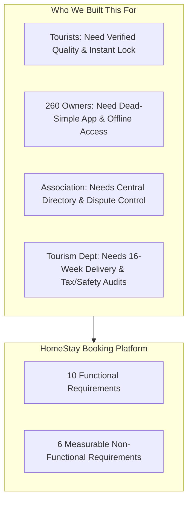

# Case Study 103: HomeStay Booking Platform
## Presentation Master Document: From Problem to Solution

## 1. The Story & The Problem Statement

### 1.1 The Context: Hill Tourism in Uttarakhand
Imagine 260 homestays spread across the scenic, rugged mountains of Uttarakhand (villages around Nainital, Almora, Pithoragarh, and Chamoli). These homestays are run by local families who open their homes to travelers looking for authentic pahadi hospitality.

### 1.2 How Bookings Happen Today (The Mess)
Currently, there is no system. Everything happens informally over **phone calls and WhatsApp chats**:
* A tourist calls an owner to ask for a room.
* Another family member might confirm a different tourist for the same room on WhatsApp.
* Someone writes a note in a paper diary that gets misplaced.

### 1.3 The Core Problems on the Ground
1. **Frequent Double-Bookings during Peak Season:**  
   During May and June, tourists travel 8 to 10 hours up mountain roads only to find their room has been promised to someone else. This leads to stranded tourists, arguments, and huge reputational damage.
2. **Zero Quality Verification for Tourists:**  
   Tourists have no reliable way to see verified photos, genuine amenities (hot water, road access, parking), or authentic guest reviews. Bait-and-switch pricing is common.
3. **Weak & Intermittent Mountain Internet:**  
   Hill villages do not have high-speed 5G/broadband. Connectivity is often patchy 2G/EDGE or drops out completely for hours.
4. **Low Digital Literacy Among Homestay Owners:**  
   Most homestay owners are elderly villagers who are not tech-savvy. They cannot navigate complicated apps or complex forms.
5. **The Strict 16-Week Deadline:**  
   The Uttarakhand Tourism Department is funding the project, but with one non-negotiable condition: **The platform must be live before the summer tourist season starts in exactly 16 weeks.**

---

## 2. Given Project Data

* **Total Homestays to Onboard:** `260 homestays`
* **Onboarding & Listing Setup Effort:** `2.5 person-hours` per homestay (visiting in person, capturing verified photos, recording amenities, checking license).
* **Field Onboarding Team:** `3 field staff`, working `5 productive hours/day` each.
* **Software Development Effort:** `1,150 person-hours` total engineering work.
* **Development Team:** `3 software developers`, working `6 productive hours/day` each.
* **Mid-Project Checkpoint (Week 8 of 16):**
  * Planned Spend ($PV$): **₹6.00 Lakh** (Planned work complete: **50%**)
  * Total Project Budget ($BAC$): **₹12.00 Lakh**
  * Actual Spend ($AC$): **₹5.20 Lakh** (Actual work complete: **42%**)

---

## 3. Project Objectives

1. **Requirements Engineering (The Focus):**
   * Elicit needs from all 4 stakeholders: Tourists, Homestay Owners, Tourism Association, and Tourism Department.
   * Define **10 Functional Requirements (FRs)** covering listings, locking, payments, SMS/WhatsApp vouchers, and offline mode.
   * Establish **6 Non-Functional Requirements (NFRs)** with strict, measurable numbers (no vague claims like *"it should be fast"*).
   * Prioritize features using **MoSCoW** to protect the 16-week summer deadline.
2. **Software Architecture & UML:**
   * Model the system using standard UML diagrams (Use Case, Class, Sequence, Activity, State).
   * Ensure the **calendar inventory lock** and **payment processing** are loosely coupled so slow networks never crash room availability.
3. **Realistic Schedule & Estimation:**
   * Mathematically compute how long development and field onboarding will take.
   * Prove why a purely sequential plan fails and how a **staged, overlapping schedule** delivers the platform within 16 weeks.
4. **Testing & Defect Prevention:**
   * Design Boundary Value Analysis (BVA) and Equivalence Class Partitioning (ECP) for guest counts and stay lengths.
   * Build a decision table for race-condition overbooking prevention and cancellation refunds.
   * Quantify software quality using Defect Density and Defect Removal Efficiency (DRE).
5. **Risk Governance & Mid-Term Project Control:**
   * Calculate Week-8 Earned Value Management (EVM) variances and present them in plain English.
   * Mitigate the top 3 risks: weak mountain internet, overbooking collisions, and low smartphone literacy.

---

## 4. Software Requirements Specification (SRS)

---

### 4.1 The 10 Functional Requirements (FRs)

| Req ID | Feature Title | What It Does (In Layman Terms) | Why It Matters in the Hills | MoSCoW |
| :---: | :--- | :--- | :--- | :---: |
| **FR-01** | **Verified Homestay Profiles** | A standardized digital catalog for each homestay containing GPS coordinates, room count, verified photos, amenities (solar water, Wi-Fi, heating), and local tourism license number. | Eliminates fake listings and tourist mistrust. | **Must Have** |
| **FR-02** | **15-Minute Temporary Calendar Lock** | When a tourist clicks "Book", the room dates are instantly locked for **15 minutes**. No other tourist can book those dates while the first tourist enters payment details. If payment isn't finished in 15 minutes, the dates unlock automatically. | **Completely stops online double-booking.** Solves race conditions during high-demand summer weekends. | **Must Have** |
| **FR-03** | **Integrated Secure Checkout & Escrow** | Tourists pay online via UPI, debit/credit cards, or Net Banking. The money is placed in an escrow holding account and only released to the owner upon successful check-in (minus the association platform maintenance fee). | Protects tourists from scams and guarantees hosts get paid without chasing guests for cash. | **Must Have** |
| **FR-04** | **Dual SMS & WhatsApp Booking Voucher** | As soon as payment succeeds, the system automatically sends a lightweight text SMS and a WhatsApp voucher to **both** the guest and the homestay owner, with booking codes, contact numbers, and offline road directions. | Mountain areas often lose mobile data, but basic text SMS works even on a weak 2G signal. | **Must Have** |
| **FR-05** | **Offline-First Owner App (PWA)** | A mobile web app for homestay owners that stores the next 30 days of bookings directly on the phone. Owners can view who is arriving tomorrow even when their internet is completely down. When internet returns, it syncs automatically. | Allows village hosts to run their homestay without needing a continuous active internet connection. | **Must Have** |
| **FR-06** | **One-Tap Walk-In Block** | A giant, simple button on the owner's phone screen allowing them to block off dates in 1 tap if a local trekker walks in from the road or phones directly. | Gives owners control. If an offline guest arrives, the owner blocks the room instantly so an online tourist cannot book it. | **Must Have** |
| **FR-07** | **Verified Guest Reviews** | Only tourists who have completed a verified stay receive a special digital review link (valid for 48 hours post-checkout). Strangers cannot post fake reviews. | Builds trusted word-of-mouth for genuine village hosts. | **Should Have** |
| **FR-08** | **Automated Tiered Cancellation & Refund** | If a tourist cancels:  • **> 7 days before:** 100% refund. • **2 to 7 days before:** 50% refund. • **< 48 hours before:** 0% refund (host gets paid for the reserved room). | Fair and transparent. Protects remote village hosts from last-minute cancellations when alternative guests cannot be found. | **Must Have** |
| **FR-09** | **District Association Dashboard** | An admin screen for association officers showing total registered homestays (out of 260), live occupancy rates across valleys, and active disputes. | Gives the association real-time visibility over district tourism trends instead of waiting for end-of-year surveys. | **Should Have** |
| **FR-10** | **Tourism Department Compliance & Audit Export** | A one-click reporting tool that exports quarterly footfall statistics, safety license audits, and district tax summaries into Excel/PDF format. | Satisfies government statutory and auditing requirements for public funding. | **Could Have** |

---

### 4.2 The 6 Measurable Non-Functional Requirements (NFRs)

| NFR ID | Category | The Plain-English Meaning | Exact Measurable Target | How We Test It |
| :---: | :--- | :--- | :--- | :--- |
| **NFR-01** | **Low-Bandwidth Usability** | The app must load fast even on poor 2G mountain networks. | **Initial app download $\le 450 \text{ KB}$** (gzipped). **Time-to-Interactive $\le 3.5 \text{ seconds}$** on throttled 250 kbps network. | Tested using Chrome DevTools with simulated 2G cellular throttling. |
| **NFR-02** | **Image Compression** | Room photos must never choke a slow mobile phone. | **Total photos per listing page $\le 350 \text{ KB}$**. **Single photo $\le 120 \text{ KB}$** (served in modern WebP format). | Automated client-side compressor resizes photos before uploading. |
| **NFR-03** | **System Uptime** | The booking platform must not crash during peak summer months. | **$\ge 99.5\%$ monthly uptime** (maximum allowable unplanned downtime $\le 3.65 \text{ hours/month}$). | Monitored 24/7 by external synthetic health pings every 60 seconds. |
| **NFR-04** | **Payment & Transaction Security** | Tourist money and credit card data must be 100% secure. | **0% local storage of raw card/CVV data**. All data encrypted with **TLS 1.3**. All payment callbacks verified with **HMAC-SHA256 signatures**. | Meets PCI-DSS Level 1 and Reserve Bank of India (RBI) payment guidelines. |
| **NFR-05** | **Zero Double-Booking Guarantee** | When hundreds of tourists search at the same second, no two people can get the same room. | **0.00% double-booking collision rate** under a load of **150 concurrent checkouts/second**. Lock conflicts resolved in $\le 200 \text{ ms}$. | Concurrency stress-testing with automated simulated user bots. |
| **NFR-06** | **Offline Data Resilience** | The owner's phone must keep functioning without internet. | Owner app caches **$\ge 30 \text{ days}$ of bookings** locally in IndexedDB. Background auto-sync completes in **$\le 4.0 \text{ seconds}$** once connection returns. | Tested by toggling Airplane Mode on real Android mobile devices. |

---

### 4.3 MoSCoW Prioritization (Why It Protects the 16-Week Deadline)

To ensure the system launches before summer, features are strictly categorized:
* **Must Have (M):** Verified Listings (FR-01), 15-Minute Hold Lock (FR-02), Payments (FR-03), SMS/WhatsApp Vouchers (FR-04), Offline PWA (FR-05), Walk-in Block (FR-06), Tiered Cancellations (FR-08).  
  *-> *If any of these are missing, the platform cannot go live.*
* **Should Have (S):** Post-Stay Reviews (FR-07), Association Dashboard (FR-09).  
  *-> *Important, but system can launch without them if temporary schedule pressure occurs.*
* **Could Have (C):** Automated Compliance PDF Export for Tourism Dept (FR-10).  
  *-> *These act as "shock absorbers". If onboarding slips, developers drop these first to stay on schedule.*
* **Won't Have this release (W):** Multi-currency international forex exchange, dynamic airline flight integrations.

---

## 5. Architecture, Quality & Project Control

### 5.1 Architecture & UML Design
* **How Availability and Payments are Kept Loosely Coupled:**  
  The Calendar module knows nothing about banks or credit cards. The Payment module knows nothing about room numbers. They communicate via a temporary **15-Minute Hold Token**. If payment succeeds, the token turns into a permanent booking. If payment fails or times out, the token simply dissolves and releases the room.
* **Cohesion:** Every module does one job: Calendar manages dates; Payment manages money; Notification handles SMS/WhatsApp.

### 5.2 Timeline, Estimation & Feasibility
* **Field Onboarding Math:**  
  $260 \text{ homestays} \times 2.5 \text{ hrs} = 650 \text{ person-hours}$.  
  Daily capacity: $3 \text{ staff} \times 5 \text{ hrs/day} = 15 \text{ hrs/day}$.  
  Duration: $650 / 15 = \mathbf{43.33 \approx 44 \text{ working days}}$ (**8.7 weeks**).
* **Software Development Math:**  
  $1,150 \text{ person-hours} \div (3 \text{ devs} \times 6 \text{ hrs/day} = 18 \text{ hrs/day}) = \mathbf{63.89 \approx 64 \text{ working days}}$ (**12.8 weeks**).
* **The Strategic Secret (Sequential vs. Pipelined):**  
  * If we waited for software to finish before starting onboarding: $12.8 + 8.7 = \mathbf{21.5 \text{ weeks}}$ (**FAILED! Misses summer season**).
  * Our solution: Build the simple field onboarding tool in **Sprint 2 (Week 4)**. Field staff start onboarding immediately in **Week 5** while devs continue backend work.  
  * Result: **Total project duration = 78 working days (15.6 weeks)**. **Comfortably meets the 16-week deadline!**
* **Why an Estimate is Not a Promise:**  
  Software development and mountain travel have natural variance (Cone of Uncertainty, weather landslides, network blackouts). An estimate is a probabilistic forecast that requires active risk management.

### 5.3 Testing & Quality Evidence
* **Boundary Value Analysis (BVA):**  
  * `guest_count` [Min: 1, Max: 10]: Tested $-1, 0, 1, 2, 9, 10, 11$.  
  * `stay_length` [Min: 1, Max: 30 nights]: Tested $-2, 0, 1, 2, 29, 30, 31$. Stays $>30$ days legally require a long-term lease.
* **Overbooking Decision Table:** Tests all permutations of Vacant, Held, Confirmed states, active vs. expired locks, and concurrent race conditions.
* **Defect Metrics:**  
  * **Defect Density:** $24 \text{ defects} / 15.0 \text{ KLOC} = \mathbf{1.60 \text{ defects/KLOC}}$ (Industry benchmark is 1.0 to 3.0; indicates high code quality).
  * **Defect Removal Efficiency (DRE):** $\frac{46 \text{ internal}}{46 + 4 \text{ external}} \times 100\% = \mathbf{92.00\%}$ (Significantly beats the 85% industry standard).

### 5.4 Risk Management & Week-8 Status Report
* **Week-8 EVM Health (The "Optical Illusion"):**  
  * Planned Spend ($PV$): ₹6.00 Lakh (50% work planned)
  * Actual Spend ($AC$): ₹5.20 Lakh (Spent ₹80k less than planned!)
  * Earned Value ($EV$): $₹12.0 \text{L} \times 42\% = \mathbf{₹5.04 \text{ Lakh}}$
  * **Cost Variance ($CV$):** $5.04 - 5.20 = \mathbf{-₹16,000}$ (Slight cost overrun for work done).
  * **Schedule Variance ($SV$):** $5.04 - 6.00 = \mathbf{-₹96,000}$ (**16% schedule delay; SPI = 0.84**).
  * *Plain-English Explanation to Tourism Dept:* We did not save ₹80,000. We spent less money simply because we fell behind schedule.
* **Corrective Action:** Fast-track Almora/Nainital field onboarding by hiring 1 local assistant using contingency funds, and freeze "Could Have" audit reports. Approved by the District Tourism Officer (DTO).
* **Top 3 Risks Mitigated:**
  1. *Weak 2G Internet:* Offline-first PWA with local IndexedDB cache + SMS fallback.
  2. *Overbooking Collisions:* Redis distributed lock (15-min TTL) + one-tap walk-in block.
  3. *Low Owner Smartphone Literacy:* High-contrast color-coded UI (Green = Free, Red = Booked) + in-person field staff training.

### 5.5 Interactive Prototype Demonstration (Live)
An interactive React 19 + TypeScript + Tailwind CSS v4 prototype is included in [`app/`](app/) running live at [http://127.0.0.1:5173](http://127.0.0.1:5173). It directly demonstrates:
* **FR-01 & Testing:** Search with Boundary Value Analysis limits (1–10 guests, 1–30 nights).
* **FR-02 & UML:** 15-minute countdown reservation lock with race-condition collision simulation.
* **FR-03 & FR-04:** Payment webhook simulation, split escrow payout (5% association levy), and dual SMS/WhatsApp host vouchers.
* **FR-05 & FR-06:** Owner dashboard with offline-first PWA simulation and 1-tap manual walk-in block modal.
* **FR-08:** Tiered cancellation refund engine (>7d 100%, 2–7d 50%, <48h 0%).
* **FR-09 & EVM:** Association portal showing 247/260 onboarded homestays, Week-8 EVM status report, and CPM batch rollout.