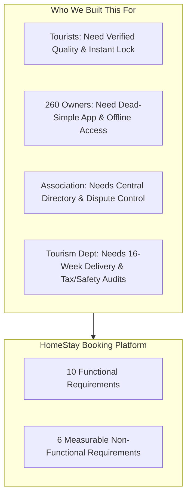

# Case Study 103: HomeStay Booking Platform
## Presentation Master Document: From Problem to Solution

## 1. The Story & The Problem Statement

### 1.1 The Context: Hill Tourism in Uttarakhand
Imagine 260 homestays spread across the scenic, rugged mountains of Uttarakhand (villages around Nainital, Almora, Pithoragarh, and Chamoli). These homestays are run by local families who open their homes to travelers looking for authentic pahadi hospitality.

### 1.2 How Bookings Happen Today (The Mess)
Currently, there is no system. Everything happens informally over **phone calls and WhatsApp chats**:
* A tourist calls an owner to ask for a room.
* Another family member might confirm a different tourist for the same room on WhatsApp.
* Someone writes a note in a paper diary that gets misplaced.

### 1.3 The Core Problems on the Ground
1. **Frequent Double-Bookings during Peak Season:**  
   During May and June, tourists travel 8 to 10 hours up mountain roads only to find their room has been promised to someone else. This leads to stranded tourists, arguments, and huge reputational damage.
2. **Zero Quality Verification for Tourists:**  
   Tourists have no reliable way to see verified photos, genuine amenities (hot water, road access, parking), or authentic guest reviews. Bait-and-switch pricing is common.
3. **Weak & Intermittent Mountain Internet:**  
   Hill villages do not have high-speed 5G/broadband. Connectivity is often patchy 2G/EDGE or drops out completely for hours.
4. **Low Digital Literacy Among Homestay Owners:**  
   Most homestay owners are elderly villagers who are not tech-savvy. They cannot navigate complicated apps or complex forms.
5. **The Strict 16-Week Deadline:**  
   The Uttarakhand Tourism Department is funding the project, but with one non-negotiable condition: **The platform must be live before the summer tourist season starts in exactly 16 weeks.**

---

## 2. Given Project Data

* **Total Homestays to Onboard:** `260 homestays`
* **Onboarding & Listing Setup Effort:** `2.5 person-hours` per homestay (visiting in person, capturing verified photos, recording amenities, checking license).
* **Field Onboarding Team:** `3 field staff`, working `5 productive hours/day` each.
* **Software Development Effort:** `1,150 person-hours` total engineering work.
* **Development Team:** `3 software developers`, working `6 productive hours/day` each.
* **Mid-Project Checkpoint (Week 8 of 16):**
  * Planned Spend ($PV$): **₹6.00 Lakh** (Planned work complete: **50%**)
  * Total Project Budget ($BAC$): **₹12.00 Lakh**
  * Actual Spend ($AC$): **₹5.20 Lakh** (Actual work complete: **42%**)

---

## 3. Project Objectives

1. **Requirements Engineering (The Focus):**
   * Elicit needs from all 4 stakeholders: Tourists, Homestay Owners, Tourism Association, and Tourism Department.
   * Define **10 Functional Requirements (FRs)** covering listings, locking, payments, SMS/WhatsApp vouchers, and offline mode.
   * Establish **6 Non-Functional Requirements (NFRs)** with strict, measurable numbers (no vague claims like *"it should be fast"*).
   * Prioritize features using **MoSCoW** to protect the 16-week summer deadline.
2. **Software Architecture & UML:**
   * Model the system using standard UML diagrams (Use Case, Class, Sequence, Activity, State).
   * Ensure the **calendar inventory lock** and **payment processing** are loosely coupled so slow networks never crash room availability.
3. **Realistic Schedule & Estimation:**
   * Mathematically compute how long development and field onboarding will take.
   * Prove why a purely sequential plan fails and how a **staged, overlapping schedule** delivers the platform within 16 weeks.
4. **Testing & Defect Prevention:**
   * Design Boundary Value Analysis (BVA) and Equivalence Class Partitioning (ECP) for guest counts and stay lengths.
   * Build a decision table for race-condition overbooking prevention and cancellation refunds.
   * Quantify software quality using Defect Density and Defect Removal Efficiency (DRE).
5. **Risk Governance & Mid-Term Project Control:**
   * Calculate Week-8 Earned Value Management (EVM) variances and present them in plain English.
   * Mitigate the top 3 risks: weak mountain internet, overbooking collisions, and low smartphone literacy.

---

## 4. Software Requirements Specification (SRS)

---

### 4.1 The 10 Functional Requirements (FRs)

| Req ID | Feature Title | What It Does (In Layman Terms) | Why It Matters in the Hills | MoSCoW |
| :---: | :--- | :--- | :--- | :---: |
| **FR-01** | **Verified Homestay Profiles** | A standardized digital catalog for each homestay containing GPS coordinates, room count, verified photos, amenities (solar water, Wi-Fi, heating), and local tourism license number. | Eliminates fake listings and tourist mistrust. | **Must Have** |
| **FR-02** | **15-Minute Temporary Calendar Lock** | When a tourist clicks "Book", the room dates are instantly locked for **15 minutes**. No other tourist can book those dates while the first tourist enters payment details. If payment isn't finished in 15 minutes, the dates unlock automatically. | **Completely stops online double-booking.** Solves race conditions during high-demand summer weekends. | **Must Have** |
| **FR-03** | **Integrated Secure Checkout & Escrow** | Tourists pay online via UPI, debit/credit cards, or Net Banking. The money is placed in an escrow holding account and only released to the owner upon successful check-in (minus the association platform maintenance fee). | Protects tourists from scams and guarantees hosts get paid without chasing guests for cash. | **Must Have** |
| **FR-04** | **Dual SMS & WhatsApp Booking Voucher** | As soon as payment succeeds, the system automatically sends a lightweight text SMS and a WhatsApp voucher to **both** the guest and the homestay owner, with booking codes, contact numbers, and offline road directions. | Mountain areas often lose mobile data, but basic text SMS works even on a weak 2G signal. | **Must Have** |
| **FR-05** | **Offline-First Owner App (PWA)** | A mobile web app for homestay owners that stores the next 30 days of bookings directly on the phone. Owners can view who is arriving tomorrow even when their internet is completely down. When internet returns, it syncs automatically. | Allows village hosts to run their homestay without needing a continuous active internet connection. | **Must Have** |
| **FR-06** | **One-Tap Walk-In Block** | A giant, simple button on the owner's phone screen allowing them to block off dates in 1 tap if a local trekker walks in from the road or phones directly. | Gives owners control. If an offline guest arrives, the owner blocks the room instantly so an online tourist cannot book it. | **Must Have** |
| **FR-07** | **Verified Guest Reviews** | Only tourists who have completed a verified stay receive a special digital review link (valid for 48 hours post-checkout). Strangers cannot post fake reviews. | Builds trusted word-of-mouth for genuine village hosts. | **Should Have** |
| **FR-08** | **Automated Tiered Cancellation & Refund** | If a tourist cancels:  • **> 7 days before:** 100% refund. • **2 to 7 days before:** 50% refund. • **< 48 hours before:** 0% refund (host gets paid for the reserved room). | Fair and transparent. Protects remote village hosts from last-minute cancellations when alternative guests cannot be found. | **Must Have** |
| **FR-09** | **District Association Dashboard** | An admin screen for association officers showing total registered homestays (out of 260), live occupancy rates across valleys, and active disputes. | Gives the association real-time visibility over district tourism trends instead of waiting for end-of-year surveys. | **Should Have** |
| **FR-10** | **Tourism Department Compliance & Audit Export** | A one-click reporting tool that exports quarterly footfall statistics, safety license audits, and district tax summaries into Excel/PDF format. | Satisfies government statutory and auditing requirements for public funding. | **Could Have** |

---

### 4.2 The 6 Measurable Non-Functional Requirements (NFRs)

| NFR ID | Category | The Plain-English Meaning | Exact Measurable Target | How We Test It |
| :---: | :--- | :--- | :--- | :--- |
| **NFR-01** | **Low-Bandwidth Usability** | The app must load fast even on poor 2G mountain networks. | **Initial app download $\le 450 \text{ KB}$** (gzipped). **Time-to-Interactive $\le 3.5 \text{ seconds}$** on throttled 250 kbps network. | Tested using Chrome DevTools with simulated 2G cellular throttling. |
| **NFR-02** | **Image Compression** | Room photos must never choke a slow mobile phone. | **Total photos per listing page $\le 350 \text{ KB}$**. **Single photo $\le 120 \text{ KB}$** (served in modern WebP format). | Automated client-side compressor resizes photos before uploading. |
| **NFR-03** | **System Uptime** | The booking platform must not crash during peak summer months. | **$\ge 99.5\%$ monthly uptime** (maximum allowable unplanned downtime $\le 3.65 \text{ hours/month}$). | Monitored 24/7 by external synthetic health pings every 60 seconds. |
| **NFR-04** | **Payment & Transaction Security** | Tourist money and credit card data must be 100% secure. | **0% local storage of raw card/CVV data**. All data encrypted with **TLS 1.3**. All payment callbacks verified with **HMAC-SHA256 signatures**. | Meets PCI-DSS Level 1 and Reserve Bank of India (RBI) payment guidelines. |
| **NFR-05** | **Zero Double-Booking Guarantee** | When hundreds of tourists search at the same second, no two people can get the same room. | **0.00% double-booking collision rate** under a load of **150 concurrent checkouts/second**. Lock conflicts resolved in $\le 200 \text{ ms}$. | Concurrency stress-testing with automated simulated user bots. |
| **NFR-06** | **Offline Data Resilience** | The owner's phone must keep functioning without internet. | Owner app caches **$\ge 30 \text{ days}$ of bookings** locally in IndexedDB. Background auto-sync completes in **$\le 4.0 \text{ seconds}$** once connection returns. | Tested by toggling Airplane Mode on real Android mobile devices. |

---

### 4.3 MoSCoW Prioritization (Why It Protects the 16-Week Deadline)

To ensure the system launches before summer, features are strictly categorized:
* **Must Have (M):** Verified Listings (FR-01), 15-Minute Hold Lock (FR-02), Payments (FR-03), SMS/WhatsApp Vouchers (FR-04), Offline PWA (FR-05), Walk-in Block (FR-06), Tiered Cancellations (FR-08).  
  *-> *If any of these are missing, the platform cannot go live.*
* **Should Have (S):** Post-Stay Reviews (FR-07), Association Dashboard (FR-09).  
  *-> *Important, but system can launch without them if temporary schedule pressure occurs.*
* **Could Have (C):** Automated Compliance PDF Export for Tourism Dept (FR-10).  
  *-> *These act as "shock absorbers". If onboarding slips, developers drop these first to stay on schedule.*
* **Won't Have this release (W):** Multi-currency international forex exchange, dynamic airline flight integrations.

---

## 5. Core Concepts: 1-Line Read-Outs & Plain-English Explanations

### 5.1 What does "Loosely Coupled" Mean?
* **1-Line Read-Out:** *"Like a wall power socket and a plug, Calendar and Payments work independently through temporary 15-minute hold tokens so a bank or network failure never crashes room availability."*
* **The Everyday Analogy:** Think of a **wall power socket and a plug**.
  * The socket gives electricity; it doesn't care whether you plug in a laptop, a phone charger, or a heater. If your charger breaks, the wall socket doesn't explode. They are **loosely coupled**.
  * If they were *tightly coupled*, the charger wire would be soldered permanently inside the wall. If your charger stopped working, you would have to break the entire wall down.
* **In our HomeStay System:**
  * The **Availability Calendar** (tracks dates) and the **Payment Gateway** (handles banks/UPI) are **loosely coupled**.
  * The calendar knows **nothing** about credit cards or UPI. The payment gateway knows **nothing** about room numbers.
  * How do they talk? Through a temporary ticket called a **15-Minute Hold Token**. The calendar locks the room for 15 minutes and hands over a token. If payment succeeds, the token is confirmed. If the bank or 2G network drops, the token simply expires, and the calendar unlocks the room automatically. Neither crashes the other.

---

### 5.2 UML Diagrams Explained in Simple Words
* **1-Line Read-Out:** *"UML diagrams are visual architectural blueprints answering who uses the system, how data is shaped, and how components interact step-by-step."*
1. **Use Case Diagram:** *"Who uses the system and what can they do?"*  
   * Shows actors (Tourist, Owner, Admin) and their actions (Search stay, Book stay, Block dates, View dashboard).
2. **Class Diagram:** *"What are the data building blocks?"*  
   * Shows entities and their relationships (e.g., A `Homestay` owns `Rooms`; a `Room` has an `AvailabilityCalendar`; a `Tourist` makes a `Booking`).
3. **Sequence Diagram:** *"Who talks to whom step-by-step over time?"*  
   * Shows the exact chronological flow for booking: Tourist clicks Book $\to$ System asks Calendar for a 15-min lock $\to$ Lock granted $\to$ Bank charges card $\to$ Webhook confirms payment $\to$ SMS sent.
4. **Activity Diagram:** *"The business flowchart with decision paths."*  
   * Shows decisions: Room available? (Yes $\to$ Lock for 15 mins; No $\to$ Suggest nearby homestays). Payment successful within 15 mins? (Yes $\to$ Confirm booking; No $\to$ Unlock room).
5. **State Machine Diagram:** *"The life stages of a single Booking."*  
   * Shows how a booking changes status: `INITIATED` $\to$ `HOLD_PENDING_PAYMENT` $\to$ `CONFIRMED` $\to$ `CHECKED_IN` $\to$ `COMPLETED` (or `CANCELLED` / `REFUNDED`).

*(Full diagrams can be viewed in [`docs/02_UML_Design_Package.md`](docs/02_UML_Design_Package.md)).*

---

### 5.3 Boundary Value Analysis (BVA) & Equivalence Partitioning (ECP)
* **1-Line Read-Out:** *"ECP groups inputs into valid and invalid buckets, while BVA tests the exact edge boundaries (like 0, 1, 10, 11) where programmers most often introduce `<` vs `<=` bugs."*
* **Equivalence Class Partitioning (ECP) — Grouping into Buckets:**  
  Divide inputs into valid and invalid buckets. For guest count (allowed 1 to 10):
  * **Invalid Low Bucket:** Less than 1 (e.g., $0, -5$) $\to$ Must reject.
  * **Valid Bucket:** 1 to 10 (e.g., $4$) $\to$ Must accept.
  * **Invalid High Bucket:** Greater than 10 (e.g., $15$) $\to$ Must reject.
* **Boundary Value Analysis (BVA) — Testing the Exact Edges:**  
  Bugs almost always happen right at the boundary lines (e.g., when a programmer writes `<` instead of `<=`). So we test the exact edges:
  * For **Guest Count [1 to 10]**: Test $0$ (just below), $1$ (exact min), $2$ (just above), $9$ (just below max), $10$ (exact max), $11$ (just above max).
  * For **Stay Length [1 to 30 nights]**: Test $0$ (same-day checkout rejected), $1$ (min stay), $2$, $29$, $30$ (max stay), $31$ (rejected; stays over 30 days legally need a direct lease agreement).

---

### 5.4 Decision Table for Overbooking & Cancellations
* **1-Line Read-Out:** *"An 'IF-THEN' logic matrix ensuring concurrent clicks on the same room reject race-condition duplicates, and cancellations refund 100% (>7d), 50% (2–7d), or 0% (<48h)."*
* **Overbooking Race-Condition:**  
  * *Condition:* Two tourists click "Pay" at the exact same millisecond for the same room.  
  * *Action:* The first request gets the 15-minute lock. The second request gets rejected immediately with a friendly message: *"Someone is currently completing checkout for these dates. Please try again in 15 minutes."*
* **Tiered Cancellations:**  
  * Cancel **$> 7$ days** before check-in $\to$ **100% refund** to tourist.
  * Cancel **2 to 7 days** before check-in $\to$ **50% refund** to tourist (50% given to host).
  * Cancel **$< 48$ hours** before check-in $\to$ **0% refund** (100% payout to host to protect rural livelihoods).

---

### 5.5 Defect Density & Defect Removal Efficiency (DRE)
* **1-Line Read-Out:** *"Our Defect Density of 1.60 defects/KLOC (below 3.0 benchmark) and DRE of 92% (above 85% standard) mathematically prove our software is production-ready."*
* **Defect Density:** *"How many bugs exist per 1,000 lines of code?"*  
  $$\text{Defect Density} = \frac{\text{Total Bugs}}{\text{KLOC (Thousand Lines of Code)}} = \frac{24 \text{ defects}}{15.0 \text{ KLOC}} = \mathbf{1.60 \text{ defects/KLOC}}$$
  * *What to say:* Industry standard is between 1.0 and 3.0. Our score of 1.60 proves the code is well-written and tested.
* **Defect Removal Efficiency (DRE):** *"What percentage of bugs did we catch internally before the end users found them?"*  
  $$\text{DRE} = \frac{\text{Bugs caught by QA (46)}}{\text{QA Bugs (46)} + \text{Bugs found by users in pilot (4)}} \times 100\% = \mathbf{92.00\%}$$
  * *What to say:* The industry benchmark is 85%. Our 92% means our team caught 92 out of every 100 issues before launch!

---

### 5.6 Week-8 EVM Variances (The "Optical Illusion")
* **1-Line Read-Out:** *"Spending ₹80k less than planned was an optical illusion: we didn't save money, we are 16% behind schedule ($SV = -₹96\text{k}, SPI = 0.84$) and slightly over budget on delivered work ($CV = -₹16\text{k}, CPI = 0.97$)."*
* **The Trick:** At Week 8, we planned to spend ₹6.0 Lakh, but our bank statement shows we only spent ₹5.2 Lakh. It looks like we saved ₹80,000!
* **The Reality:** We didn't save money; **we fell behind schedule**:
  * We planned to complete **50%** of the work ($PV = ₹6.00\text{L}$).
  * We only completed **42%** of the work ($EV = ₹12.0\text{L} \times 0.42 = ₹5.04\text{L}$).
  * **Schedule Variance ($SV$):** $EV - PV = ₹5.04\text{L} - ₹6.00\text{L} = \mathbf{-₹96,000}$ (We are **16% behind schedule**; $SPI = 0.84$).
  * **Cost Variance ($CV$):** $EV - AC = ₹5.04\text{L} - ₹5.20\text{L} = \mathbf{-₹16,000}$ (For the work we actually delivered, we overspent by ₹16k; $CPI = 0.97$).
* **The Fix:** We use contingency money to hire 1 extra local field assistant to speed up onboarding in Almora/Nainital, and temporarily freeze secondary report-export features.

---

### 5.7 The Top 3 Risks & How We Solve Them
* **1-Line Read-Out:** *"We mitigate weak internet with an offline-first PWA, peak collisions with 15-minute locks and 1-tap walk-in blocks, and low digital literacy with color-coded buttons and field training."*
1. **Weak 2G Mountain Internet:**  
   * *Solution:* The owner app works **offline-first** (saves 30 days of data inside phone storage). If mobile data dies completely, booking alerts fall back to simple text SMS and voice calls.
2. **Peak-Season Overbooking:**  
   * *Solution:* A **15-minute countdown lock** prevents online collisions, plus a giant **"Walk-in Block"** button on the owner's phone so they can block dates in 1 second when someone walks in from the road.
3. **Low Smartphone Literacy (Elderly Hosts):**  
   * *Solution:* No long forms or complex text. Just intuitive colors: **Green = Available, Red = Booked, Orange = Check-in Today**, accompanied by in-person field staff training.

---

### 5.8 Timeline, Estimation & Feasibility
* **Field Onboarding Math:**  
  $260 \text{ homestays} \times 2.5 \text{ hrs} = 650 \text{ person-hours} \div (3 \text{ staff} \times 5 \text{ hrs/day} = 15 \text{ hrs/day}) = \mathbf{43.33 \approx 44 \text{ working days}}$ (**8.7 weeks**).
* **Software Development Math:**  
  $1,150 \text{ person-hours} \div (3 \text{ devs} \times 6 \text{ hrs/day} = 18 \text{ hrs/day}) = \mathbf{63.89 \approx 64 \text{ working days}}$ (**12.8 weeks**).
* **The Strategic Secret (Sequential vs. Pipelined):**  
  * Sequential: $12.8 + 8.7 = \mathbf{21.5 \text{ weeks}}$ (**Fails the 16-week deadline**).
  * Pipelined: Build onboarding tool in Sprint 2 (Week 4), start onboarding Week 5 in parallel with dev. Total = **78 working days (15.6 weeks)**. **Comfortably meets the 16-week deadline!**

---

### 5.9 Interactive Prototype Demonstration (Live)
An interactive React 19 + TypeScript + Tailwind CSS v4 prototype is running live at [http://127.0.0.1:5173](http://127.0.0.1:5173) in [`app/`](app/):
* **FR-01 & Testing:** Search with Boundary Value Analysis limits (1–10 guests, 1–30 nights).
* **FR-02 & UML:** 15-minute countdown reservation lock with race-condition collision simulation.
* **FR-03 & FR-04:** Payment webhook simulation, split escrow payout (5% association levy), and dual SMS/WhatsApp host vouchers.
* **FR-05 & FR-06:** Owner dashboard with offline-first PWA simulation and 1-tap manual walk-in block modal.
* **FR-08:** Tiered cancellation refund engine (>7d 100%, 2–7d 50%, <48h 0%).
* **FR-09 & EVM:** Association portal showing 247/260 onboarded homestays, Week-8 EVM status report, and CPM batch rollout.